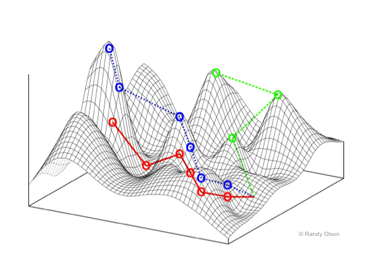

# Multi-Agent Systems

Some of the most beautiful, fascinating or strange phenomena of nature can be understood as emerging from the behaviors of interacting agents. Widely acknowledged examples include the murmuration of birds (or swarming insects, schools of fish), and the societal 'superorganisms' of ant colonies. We have come to understand that despite the obvious organization that we see at the macro-scale, there is no hierarchical center of coordination, but rather the whole emerges from simple interactions at local levels. These have been suggested as examples of emergence, or of self-organization. Which is to say, the whole is greater than a naive sum of its parts. 

---youtube:V4f_1_r80RY

Agent-based models, or multi-agent systems, attempt to understand how non-trivial organized macro-behavior emerges from individuals, known as **agents**, who are typically mobile, and sense and respond to their world primarily at a local-level. Agent-based abstractions have arisen somewhat independently in several fields, thus their definition can vary widely. However, in most cases, agent-based models consist of **populations** that typically operate in parallel within a spatial environment. Each autonomous agent interacts locally within an environment populated by other agents, but behaves independently without taking direct commands from other agents nor a global planner or leader.

Agent-based models have applications from microbiology to sociology, as well as video games and computer graphics. As a biological approximation, an agent could refer to anything from an individual protein, virus, cell, bacterium, organism, or deme (a population group). Agent-based simulations share many features with particle systems, and the two are sometimes conflated.

Just like CA, agents sense and act at local distances, and at times, the self-organizing behavior of systems of even relatively simple agents can be unpredictable, complex, and generate new emergent structures of order. But unlike CA, which roots a program in a particular spatial location (the cell), an agent-based program is mobile in free space.

### System components

Here are some of the features typically considered in an **agent-based model** or **multi-agent system**:

- A **population** of agents, each with:
  - **Properties**: Persistent but variable features of an agent (varying between population members and over time), **location** such as position, direction; **mobility**. such as speed, velocity; **external features**, such as size, color, and **internal features** such as energy level, and so on. 	
  - **Affects**: Limited capacities of sensing (or receiving messages from) the environment (possibly but not necessarily other agents). Importantly, these senses are **egocentric** rather than **allocentric**; and usually at a relatively short maximum distance.
  - **Effects**: Limited capacities of performing actions on (or sending messages to) the environment, or changing its own properties. Usually this includes some capacity to move through space. Again, these are egocentric rather than allocentric.
  - **Processing**: An information processing capacity to select responses to sensations and states. 
    - This can be seen as a form of **decision making** or more generally **action selection**
    - This capacity may also include information storage (memory).
- An **environment**: an essential and sometimes overlooked aspect of models is the environment the agent inhabits -- which may include:
  - other agents, with physical and/or communication interactions, as well as 
  - other spatial dynamics that can affect and be effected by the agents therein, including addition, removal, diffusion, limiting, stochastics, etc.
- **Initial conditions** and **limiting conditions** (including **boundary consitions**) of the above

## Agents and Cellular Automata

So far we have been building everything as cellular automata in shader programs, because these are a natural fit. Among these we *have* seen or built some agent-like systems, such as Langton's Ant and the Termite model. 

The most clear distinction between most CA and most agent-based systems are that agents are not typically distributed in a grid, and are quite often mobile over a potentially **variable position** in continuous space. The Ant and Termite models had mobile agents, but they were always fixed in a single grid location. 

Typically agents have a number of other **properties** (persistent individual variable states) besides position that they carry with them as they move. Usually a mobile agent will have a freely variable continuous **direction** or a **velocity**. The Ant and Termite models also had a direction, but it was limited to discrete N, S, E or W directions, not any continuous direction. 

Is it possible to model agents with continuous positions and directions within a discrete shader-based program? Before tackling the complexities of agents, let's start with something more elementary: continuously mobile particles. 

## Particle CA

When we looked at porting the Ant and Termite models to GLSL, we found that we had to shift our perspective. Rather than taking the perspective of a living agent -- the ant or termite -- as it moves around space, we had to shift our perspective to a single, unmoving point in space -- the cell -- and handle the conditions under which this cell is occupied or not. This is a less intuitive way of thinking, but it can be the basis of some quite powerful techniques.  


<!--
### Block rule CA

Since mass-preservation can be ensured by considering the neighbourhood before *and* after each transition, rules are often expressed in terms of a *block*. For a 2D CA, the simplest block is a 2x2 region (the *Margolus neighborhood*).


A 2x2 block of 2-state automata has 2^3 = 16 possible configurations. A bit like a sprite-sheet in fact. So, one way of encoding a rule is to map all the 16 transitions in a lookup table. But, how does this "move"?

A clever technique to simulate block-based rules is to shift the block grid on each successive frame, such that the even-aligned and then odd-aligned blocks interleave  ([see wikipedia](http://en.wikipedia.org/wiki/Block_cellular_automaton)). Note that a block rule CA does not need to be double-buffered, since block updates do not overlap. (By extension, a 3x3 block rule would need 3 steps to cover the space.)

Examples of 2x2 block rule CA are listed [here](http://psoup.math.wisc.edu/mcell/rullex_marg.html) -- many of these are implemented below. Note how simply the rules can be encoded using a minimal notation. Could you write a program to read this notation & turn it into a simulation? Could you use such an idea for other systems?

<p data-height="300" data-theme-id="18447" data-slug-hash="NGxJpP" data-default-tab="js,result" data-user="grrrwaaa" data-pen-title="Block Rules: 2019" data-preview="true" class="codepen">See the Pen <a href="https://codepen.io/grrrwaaa/pen/NGxJpP/">Block Rules: 2019</a> by Graham (<a href="https://codepen.io/grrrwaaa">@grrrwaaa</a>) on <a href="https://codepen.io">CodePen</a>.</p>
<script async src="https://static.codepen.io/assets/embed/ei.js"></script>

- The block-rule CA especially hints at another interpretation of CA as a pattern-based *rewriting system* -- a point we will return to later in the course. And in fact, many CA can be understood as the application of pattern-based rewrites, in which a region of space that matches a given template pattern is replaced by a new region with the template's corresponding result (or action). Can you think of other ways to use pattern-matching & rewriting for CA?
-->


### Nearest Particle Tracking

Typically to render millions of particles in OpenGL we need to have a vertex buffer of point locations and vertex array rendering pass.  Each vertex stores the position of the particle in space, which can be any floating point numbers. The vertex array buffer is a block of memory, with one element per particle, and space is implicit. 

None of this is possible in the more constrained space of a fragment shader, nor can it be formulated as a Cellular Automaton.  In a cellular automaton, the ONLY data structure we have is the lattice of cells. There cannot be a separate array of particles; the particles have to be represented by the cell states. How can a particle, which can be at any floating-point location in space (not just at a specific pixel), be represented in a Celllar Automaton, where cells are only at discrete pixel locations?

> The core idea here is relatively simple, but remarkably flexible and efficient: **each pixel stores information about the nearest particle to it**. 

It's worth considering some implications of this idea:

- The nearest particle might be within the bounds of the cell, or it might be in a neighbouring cell, or it might be tens or hundreds of cells' distance away. Nevertheless, this cell must track the nearest particle.  

- We'll need to make sure that a cell is always tracking the nearest particle. That means we need some kind of search & sorting method to figure out if any other nearby cell has a particle that is actually closer, and switch to tracking that instead. 

- There could be hundreds of cells tracking the same particle.  Every one of them will run a simulation step for the particle, to determine how it moves through space, so they all better agree on what that simulation step is!  That is, **the simulation system should be deterministic**. 

- What happens if two particles end up passing through the same cell? [A good thought experiment to consider!]

---

Let's use a Buffer to store our particle information. Let's say that each particle has a position (in pixel coordinates), stored in the `.xy` component of the Buffer. Perhaps the particle also has a current heading direction, which we can store in the `.z` component of the buffer. And perhaps it has a color hue, which we can store in the `.w` component of the buffer. 

```glsl
    // initialization:
    if (iFrame == 0) {
        // first property is location (in pixels), stored in .xy:
        // quantize location by rounding to nearest N
        float N = 100.;
        A.xy = N * floor(fragCoord/N + 0.5);
        // seed a random number from this position:
        vec4 noise = random4(vec3(A.xy, iTime));
        // random direction, in 0..1 (or you could also store it as radians in 0..TWOPI)
        A.z = noise.z;
        // another agent property -- e.g. could be used for colour hue:
        A.w = noise.w;
    }
```

> Notice something important here: we seed the random number generator using the quantized location, not fragCoord.  **Why?**

Now how can we render this?

We can't just draw the contents of this buffer directly, because the .xy component is measured in pixels, and these numbers are mostly going to be much larger than the 0..1 range we can render as pixels.  But we can simply divide `A.xy/iResolution.xy` to get a normalized 0..1 range, similar to a texture coordinate, which we can use to render the data. 

These don't look like particles though. To render them as a particle, we can look at the **distance** between our actual pixel location (`fragCoord`) and the particle's pixel location (`A.xy`), and make the pixel bright if the distance is small, and dark if the distance is large.  Examples:

```glsl

    fragColor = vec4(exp(-0.3*distance(fragCoord, A.xy)));

    fragColor = vec4(smoothstep(4., 1., distance(fragCoord, A.xy)));
```

We could also paint the colour of this particle, as a helpful way to see what pixels are currently tracking it.  Here we take the `A.w` value, which we initialized to a random number, and convert this into a colour using the `hsv2rgb()` function [defined in our GLSL tutorial page here](glsl.html#common-color-manipulations).  This would make a nice background region for the particle to be drawn on top of. 

```glsl
  fragColor = hsv2rgb(vec4(A.w, 1., 0.75, 1));
```

Next, we want the particles to start moving.  First we extract the heading `A.z`, and convert it from the 0..1 initial range into an angle in radians by multipling by 2*pi (6.283185307).  Then we turn that angle into X and Y direction components using `cos` and `sin`, as usual for a polar to cartesian conversion.  Then we scale that by our delta time to turn it into a velocity, and add that to our particle's position:

```glsl
    // get the heading of the particle (in radians)
    float angle = A.z * TWOPI;
    // convert this polar direction to cartesian X & Y components:
    vec2 dir = vec2(cos(angle), sin(angle));
    // use this to move the particle's position:
    A.xy += dir * iTimeDelta;;
```

Something is still clearly missing. Our particles are now moving, but their regions -- the cells that track them -- are not changing. Pretty soon the particles have left their tracked region behind.  How do we get the regions to move with the particles?  

Actually, that's not the right way to state the problem.  Remember, for a CA, we always have to think from the cell's point of view.  And from the cell's point of view, the problem is this: how can we make sure it is still tracking the nearest particle?

In most CA's, what a cell can do is ask what its neighbours are up to. In this case, a cell can ask the neighboring cells, "what is *your* nearest particle?".  Based on that, it can ask whether *that* particle is actually nearer than the particle the cell is currently tracking, and if so, switch to tracking *that* particle. We're going to want to ask this question for many neighbours, so let's wrap it up into a function:

```glsl
vec4 getNearer(vec4 A, vec2 fragCoord, vec2 offset) {
    // N is the particle at a pixel nearby
    vec4 N = texture(iChannel0, (fragCoord+offset)/iResolution.xy);
    // return whichever is closer, A or B:
    return distance(N.xy, fragCoord) < distance(A.xy, fragCoord) ? N : A;
}
```

Even if we only compare the four nearest pixels, or even the 8 neighboring pixels, this is enough to ensure that before long, the pixels are almost always tracking their nearest particles. 

```glsl
    A = getNearer(A, fragCoord, vec2(-1,  0));
    A = getNearer(A, fragCoord, vec2( 1,  0));
    A = getNearer(A, fragCoord, vec2( 0, -1));
    A = getNearer(A, fragCoord, vec2( 0,  1));
```

Or for a wider search, using for loops:

```glsl
  for (int x=-2; x<=2; x++) {
        for (int y=-2; y<=2; y++) {
            A = getNearer(A, fragCoord, vec2(x, y));
        }
    }
```

This converges toward a **Voronoi partition** of the space. 


In mathematics, a Voronoi diagram is a partition of a plane into regions, where each region is defined as being nearer to one specific object point than any other.  Each region, or "Voronoi cell", consists of all points of the plane that are closer to one object point than to any other.  

> It may remind you of the *foam-like* images we saw when [we modified the Ising Model to have multiple possible states](https://www.shadertoy.com/view/W3dyWl), and copying neighbour states at random if the entropic gradient was more preferable.  In many ways we are doing the same, but rather than minimizing energy gradients, here we are copying neighbors to minimize particle distances. 

It converges very quickly in most cases, though sometimes you will notice a kind of 'paint filling' action. This is the result of a progressive search & sort that we are doing at the pixel level, updating one pixel per frame.  Testing against a wider radius of pixels with the `getNearer` function will make this filling action progress more quickly. 

> This also defines a kind of 'maximum speed' for particles in the space - if they moved too quickly, the search & sort action would not be able to keep up with them, and some particles may be lost or some other boundary issues manifest. Try setting the particle velocities higher to see how the Voronoi partitioning struggles to keep up. 

### Boundary conditions

Since particle positions can be any floating point value, they can easily go outside the pixel extents of the image -- and indeed our particles are wandering off the image. As with CA, we can decide how to handle the **boundary conditions** of an agent-based system in a few different ways, including:

- **clamping** agents at the borders, with `clamp(pos, vec2(0), iResolution.xy)`
- **modifying** their velocities/directions to point them back toward the center, like a reflection or 'bounce', etc.
- **wrapping** agents around opposite borders (making a 'toroidal' space).  
- simply letting them die

> Note that we might also consider different boundary regions -- it doesn't have to be a rectangle!  

For example, here's how to make particles "bounce" off the boundaries:

```glsl
    // get the bounded position within the screen image
    vec2 b = clamp(A.xy, vec2(0), iResolution.xy);
    // compare the bounded and actual positions -- if they are different, reflect their orientations:
    if (A.x != b.x) { A.z = 0.5 - A.z; } // reflect in Y axis
    if (A.y != b.y) { A.z = 1.0 - A.z; } // reflect in X axis
    // also, actually clamp the position on screen
    A.xy = b.xy; 
```

If you wanted the space to be toroidal, such that leaving one edge a particle would appear on the opposite edge, you would also need to make several changes to `getNearer`.  Can you think why?

### Observations

> Step back for a moment and think about what is happening here, because it is quite odd.  We appear to be tracking individual particle points through continuous space, and updating the boundary regions between them, without ever having a data structure storing a list of particles.  We *only* have pixels, creating the illusion (or simulation) of freely moving particles!

Try reducing the `N` we used to initialize the particles in the space.  How many particles can this system simulate? Does it cost more computation to have more particles?

### Mass Preservation

We have looked at mass preservation in some of our earlier CAs, including for processes of diffusion (blur).  Simply it means that the total amount of "stuff" before running a frame's transition rules (the update program) is the same as the total amount of "stuff" after running it.  For a particle system, it could mean that the total number of particles in motion should remain constant. That is, the total amount of "stuff" in the world never changes, it just moves around.  Mass preservation is a key requirement for accurately modeling fluids using particle hydrodynamics, for example. 

> Note that our Ant and Termite models were not strictly mass-preserving: can you explain why? 

Is our particle-tracking CA mass-preserving?  Does the total number of particles remain constant?  Strictly speaking it isn't, but it can survive at *near preservation* for longer than you might expect. Even if two particles move through the same cell, they may continue to survive because nearby pixels may still be tracking them!  Only when the particle density gets closer to the pixel density are we likely to lose many particles. If you zoom in to look at the voronoi regions at a closer pixel level, it's actually remarkable how well particles survive. 

### Particle-based CA and Digital Physics


> In 1969, German computer pioneer (and painter) Konrad Zuse published his book [Calculating Space](ftp://ftp.idsia.ch/pub/juergen/zuserechnenderraum.pdf), proposing that the physical laws of the universe are discrete by nature, and that the entire universe is the output of a deterministic computation on a single cellular automaton. This became the foundation of the field of study called *digital physics*. Zuse's first model is a 3D particle CA.

A CA-inspired digital physics hypothesis is currently being promoted by Stephen Wolfram, as described in his magnum opus [A New Kind Of Science](http://www.wolframscience.com/nksonline/toc.html).

Those models are determinsitic, but particle CA can also use probabilistic rules to simulate brownian motions (like our termite explorers) and other non-deterministic media (but the rules would usually still need to be matter/energy preserving over long-term averages -- i.e. probabilities must balance to preserve mass). Particle CAs can also benefit from the inclusion of boundaries and other spatial non-homogeneities such as influx and outflow of particles at opposite edges to create more interesting gradients or otherwise keep the system away from equilibrium (a *dissipative system*).

## Random Walks in Nature

Our particles move very robotically at present. We can give them some "life" by introducing variations into the motion, suggestive of an agent making decisions in response to an environment. 

The simplest way is to introduce stochastic changes to the direction/velocity of motion. We would typically want to allow turns up to a certain limit (in radians), with equal chance of clockwise and anticlockwise rotation, e.g. ```maxturn * (noise.x - 0.5)```. 

The result is a **random walk**. Random walks are a well-established model in mathematics, with a physical interpretation as [Brownian motion](https://en.wikipedia.org/wiki/Brownian_motion) -- though, a more physically accurate form of Brownian motion would update the velocity sporadically (modeling random collision by a particle), rather than on every frame. 

Essentially, for an agent a **random walk** involves small random deviations to steering. This form of movement is widely utilized by nature, whether purposefully or simply through environmental interactions. Can you think why?

### Agent-environment Dynamics

Our agent however still lives in a void, with no environment to respond to. Even the simplest organisms have the ability to sense their environment, and direct their motions accordingly; they depend on it for survival. 

## Chemotaxis: traversing environmental gradients

One of the simplest examples is **chemotaxis**. Chemotaxis is the phenomenon whereby somatic cells, bacteria, and other single-cell or multicellular organisms direct their movements according to certain chemicals in their environment. This is important for bacteria to find food (for example, glucose) by swimming towards the highest **concentration** of food molecules, or to flee from poisons (for example, phenol). For example, the E. Coli bacterium's *goal* is to find the highest sugar concentration (see video below). In multicellular organisms, chemotaxis is critical to early development (e.g. movement of sperm towards the egg during fertilization) and subsequent phases of development (e.g. migration of neurons or lymphocytes) as well as in normal function. [wikipedia](https://en.wikipedia.org/wiki/Chemotaxis)

---youtube:F6QMU3KD7zw

---youtube:-GD0kXgYv2A

Sensing a **concentration** is rather like smell: the feature being detected is local to the agent, but is not a solid object with a distinct boundary. It is *diffuse*: it seems instead to occupy all parts of space to varying degrees. We model such kinds of spatial properties as intensity **fields**, such as density fields, probability fields, magnetic fields, etc. Fields occupy all space but in different intensities. But since our simulations are limited in memory, we *simulate* such continuous fields with discrete approximations, such as grids. We can model this in our shaders using an external texture (for a static field) or an additional Buffer (for a dynamic field).

The choice of **environment** agents will respond is just as important as the design of agents themselves, including both its **initial state** and its **continuous processes**. If the field is entirely homogenous, in which there are no spatial variations, there is nothing significant to sense. On the other hand, if the field is too noisy, it can be too difficult to make sense of. How can we make a better environment?



It is helpful to think of the environment as a landscape, with mountain tops where the intensity is high, and valleys where the intensity is low. (Keep this image in mind -- we'll return to this again.)

**What makes an interesting landscape to explore & make sense of?** A homongenous landscape is like a flat plain -- no place is better than any other. But a noisy landscape is like a city block designed by a madman -- difficult to do anything but get lost. Perhaps one that has an interesting distribution of hills and valleys; where height (intensity) tends to be more similar at shorter distances but tends to be more different at larger distances. 

### Generating landscapes

One way to get a landscape is to use an existing image. 

Another way is to create a landscape through distance functions:

- A simple "intensity mountain" can be a function of distance from a central point (the peak or apex of the mountain). 
- A bounded region, by comparing or smooth-stepping with a distance threshold
- A more complex environment created by combining multiple such distance functions, whether additively, subtractively, or using min and max operators, etc. 

Another way is to start with noise, and progressively smoothen it to turn it into a more gentle field of hills.  Smoothing can be as simple as an interation of blur or other averaging operations. 

Or another way is to use a cellular automaton, such as any of the methods we have explored so far, to generate environments. 

### Sensing the field

The simplest way for an agent to sense a field by "smell" is to sample the field's value at the agent's location, using texture lookup. (More accurately, we could sample at the location of a sense-organ on the agent's body).

## Action Selection

Once we have a sense, how should we respond? Here we need to equip our agent with some capabilities of taking **action**, and likely **decision-making**, sometimes known as **action selection**, that uses the input of sense to map to the output of action, in order to achieve a desired result. 

When we look at microbiology we can find some remarkably simple action & decision-making mechanisms to achieve effective goal satisfaction. Let's look at chemotaxis with the E. Coli again: 

---youtube:ZV5CfOkV6ek

An E. Coli bacterium lives in a very limited world:

- It has no eyes or ears to sense at a distance, it can only sense the sugar concentration at its current location. 
- It has no real sense of space: no internal "map", not even a sense of direction!  
- Worse, its range of actions are limited to twisting its flagella either clockwise or anticlockwise, resulting in just two possible modes of *locomotion*: 
  - Move forward (more or less straight)
  - Tumble about (fairly randomly)

This is a very limited [umwelt](https://en.wikipedia.org/wiki/Umwelt).

We can certainly model these two modes of locomotion in an agent, by varing the factors of our random walker.  Even something as simple as modifying the maximum degree of random turn should alternate between more random walks versus more linear progressions. 

But how does this solve the problem of climbing the sugar gradient?


### Modeling E. Coli

E. Coli uses a very simple chemical **memory** to detect whether the concentration at the current moment is better, worse, or not much different to how it was a few moments ago. That is, it detects the differential-as-experienced, or gradient traversed, by measuring its change over time. 

Even the actual intensity of the sugar concentration no longer matters; **all that matters is whether life is getting better or worse**, and acting accordingly. If things are getting better, keep swimming; otherwise, prefer tumbling. With just a few tuning parameters, the method can lead to a very rapid success. 

So all we need is to compare the sugar concentration with the agent's memory (a stored property) of the concentration on the last time step, and choose the behaviour accordingly (and of course, store our sensed value in memory for the next update).

Since our agent state is limited to a single `vec4`, and we have already used two floats for position, and one for direction, we only have one float left to work with -- and we can use this for the agent's memory.  Then our **action selection** could be expressed as approximate psuedocode like this:

```
  sense = [read texture at agent.xy]
  heading = agent.z
  memory = agent.w
  if (sense < memory) 
    // life is getting worse, tumble about:
    heading += [large random deviation]
  else 
    // life is getting better, head on!
    heading += [very small random deviation]
  // update heading
  agent.z = heading
  // remember state for next frame
  agent.w = sense
  // now move agent with new heading
```

Note that not all kinds of landscapes are **significant** to this life strategy. The strategy only works when the variations of sugar concentration in the environment are fairly smooth, which is generally true for an environment in which concentrations diffuse. Try again with noisy or homogenous environments, and see how well the agent fares. 

## Dynamic fields

So far, our sugar field is static. It would be nice to see what a continuously dynamic field offers. 

For example, we could let the mouse add more sugar to the space.  This might not be completely effective to attract agents, as there can be large spatial discontinuities. If agents happen to be on part of a drawn path, they might follow it, but otherwise they are unlikely to find it. 

Or we could also remove the need of human input by creating a separate process as a "source", randomly depositing sugar over the space as it goes.  

Adding a diffusion process (a feedback blur) will help agents find  sources by creating gradients.  

### Background Noise

We might also notice that even when the sugar is quite dissipated, the agents can still find the strongest concentrations. If we don't find this realistic, one thing we might consider adding is a low level of background noise. The rationale is that even if sensing is perfectly accurate, small fluctuations in the world (such as due to the Brownian motion of water and sugar molecules) make it impossible to discern very small differences. The randomness added must be signed noise, balanced around zero such that overall the total intensity is statistically preserved. Note that the amplitude of this noise will have to be extremely high if it is applied *before* the diffusion, or very low if applied *after* diffusion. The effective results are also quite different.

Or instead, we could add small deviations to the sensors in the agents themselves, emulating a limited accuracy of sense.

### Evaporation and Consumption

If we are continuously adding sugar, it will accumulate over time, and the more we draw, the more the screen tends to fill up. If we are also diffusing, the field will tend toward grey. We need some other process to reduce this total quantity to make a balance. One way to do that is to add a very weak overall decay to the field -- as if some particles of sugar occasionally evaporate.

Of course, our agents aren't just looking for sugar to show it to us -- they want to eat it! We can also add the effect of this on the environment by *removing* intensity from the field near to each agent. 

Since this changes the field, it will also have to be a process that is implemented in the field's shader.  We simply need to look up whichever agent the current pixel is tracking, figure out if that agent is close enough to the current pixel to actually eat it, and if so, remove quantity from the pixel accordingly.  You could do this by multiplying by a number less than one, or by subtracting (but if subtracing, you might need to be careful not to end up making the field intensity negative!)

### Other field dynamics

A very different alternative to diffusion, scaling, adding noise, clamping etc. is to use something closer to an asynchronous CA, in continuous process, rather as we did before for field initialization. This makes a more challenging, but more interesting, dynamic landscape for the agents to navigate. 

> Obviously there's a hint here of how it might be interesting to pair our agents with some other CAs for field processes... perhaps the Forest Fire model, for example.


## Are two sensors are better than one?

Many insects, arachnids, snails, and other organisms perform environmental sensing using a pair of antennae extended from their body; effectively 'sampling' the environment at two physical locations. What advantage might this have for chemotaxis? 

Perhaps, by sampling at two points in *space* we can determine the field gradient immediately without latency, and perhaps this can create a more responsive and continuous selection of swimming/turning choices?

We can try giving agents two sensors, both ahead of the agent (to draw movement forward) and to the left and right of the agent (to discriminate which direction is better to turn). Let's call these sensors "antennae". 

A bit of math is needed to compute where each antenna is located in the world. First let's define a vector representing an antenna in the local coordinate space of the agent, where the Y axis is always in front of the agent, and the X axis is to the right of the agent.  Then we need to rotate this vector to match the current angular heading of the agent, and translate this rotated vector to the position of the agent. Translation is just vector addition, but for rotation we will want to create a rotation matrix:

```glsl
// create a 2D rotation matrix from an angle in radians:
mat2 rotate2d(float angle) {
    float s = sin(angle);
    float c = cos(angle);
    return mat2(
        c, -s, 
        s, c
    ); 
}
```

With this rotation matrix, we can rotate any vector:

```glsl
  mat2 rot = rotate2d(agent.z * TWOPI);
  vec2 sensor = vec2(1, 1);
  vec2 sensor_in_world = agent.xy + rot * sensor;
```

With two such sensors we can sample the environmental field at both locations to get two sensor values, that are always ahead and to the right or left of the agent.  Now the decision-making can respond to these values. We might consider which direction has a better smell (left or right), we might consider the difference between the smells, we might consider the total of the smells too, in order to determine which way to turn, and how much to turn.

It turns out that this strategy is not only great for diffuse fields, but also can function very well for following narrow lines of sugar. That is, aligning movement along given "trails" -- paths of more intense chemical markers, such as the pheromone trails laid down by ants!

This process is integral to the agents navigating city data in the [Infranet](https://artificialnature.net) artwork:

<iframe width="560" height="315" src="https://www.youtube.com/embed/AbcZ2f5fdNc" frameborder="0" allow="accelerometer; autoplay; clipboard-write; encrypted-media; gyroscope; picture-in-picture" allowfullscreen></iframe>


### Slime Mould

A classic example here is the simulation of a slime mold (Physarum polycephalum), as described in Jeff Jones' paper for the Artificial Life Journal:

> [Jones, Jeff. "Characteristics of pattern formation and evolution in approximations of Physarum transport networks." Artificial life 16.2 (2010): 127-153.](https://uwe-repository.worktribe.com/output/980579/characteristics-of-pattern-formation-and-evolution-in-approximations-of-physarum-transport-networks)

> "Inspired by ... the true slime mold Physarum polycephalum, we present examples of complex emergent pattern formation and evolution formed by a population of simple particle-like agents. Using simple local behaviors based on chemotaxis, the mobile agent population spontaneously forms complex and dynamic transport networks. By adjusting simple model parameters, maps of characteristic patterning are obtained. Certain areas of the parameter mapping yield particularly complex long term behaviors..."

[Here's a quick teaser](https://www.shadertoy.com/view/mlSSWW)

The system presented essentially has two components: 

1. A layer of particle-like **agents** moving through space, and
2. A continuum **field** layer of chemical signals, in which creatures leave "trails" for others to follow

These two layers affect each other in a feedback cycle: the agents sense the trail layer to change their locomotion, and as they move they also deposit material into the trail layer. That is, they both read and write trails. Meanwhile, the trail layer itself also has some dynamics of dissipation and decay. 

The agent senses the space a three points in front of it: one straight ahead ("F"), one ahead to the left ("FL"), and one ahead to the right ("FR").  According to the trail map values under each sensor, it chooses how to turn as it moves. The pseudo code from the paper states:

```
    if (F > FL && F > FR) {
        // no change to heading
    } else if (F < FL && F < FR) {
        // rotate randomly left or right
    } else if (FL < FR) {
        // rotate right
    } else if (FR < FL) {
        // rotate left
    }
```

--- 

#### Implementation

For the trail layer, we will want some kind of diffusion and decay.  A simple blend (say 25%) with the average of the four neighbor pixels is the simplest, and may be enough, combined with a decay factor (say 97%).  The diffusion could be improved and both can be made more variable if you want. 

Maybe you want to mix in an external image source as a "map", or even the webcam -- it may have to be quite heavily mixed in to have an effect. 

Deposits from the nearest agent depend on distance; I found that `e^-(distance_squared)` worked well. 

For the agents, we will need to find the nearest agent first, perhaps searching over a 2 or 3 pixel range. 

Then we create 3 sensors, ahead and to the left & right of the agent. (An angle of 30-40 degrees, or pi*0.2, and a distance of about 10 pixels, seemed to work for me.)  These sensors then sample the trail field, and this is used to select between motion using the rules above.  (I found turns of about 1 degree, or `pi*0.005`, worked well.)  

However, very similar results can be achieved without any branching code, and using only two sensors, as follows:

```
  rotation = (FL - FR)*trailfactor + (noise - 0.5)*wanderfactor
```

I also found it helpful to randomize the direction of an agent if the nearest agent is far away (say, more than 10 pixels). Can you think why?

With the new heading, the agent moves forward at a certain speed. (I also found it helpful to scale the speed by the field intensity.)

---

See also: https://cargocollective.com/sagejenson/physarum

> A variation of this system is how we modeled the mycorrhizal fungal growth in the artworks "Entanglement", and interactively with "We Are Entanglement".

---youtube:efAH6yUpw6U


### Stigmergy and Pheromone Trails

*Stigmergy* is a mechanism of indirect coordination between agents by leaving traces in the environment as a mode of stimulating future action by agents in the same location. For example, ants (and some other social insects) lay down a trace of pheromones when returning to the nest while carrying food. Future ants are attracted to follow these trails, increasing the likelihood of encountering food. This environmental marking constitutes a shared external memory (without needing a map). However if the food source is exhausted, the pheromone trails will gradually fade away, leading to new foraging behavior. 

Traces evidently lead to self-reinforcement and self-organization: complex and seeminly intelligent structures without global planning or control. Since the term stigmergy focuses on self-reinforcing, task-oriented signaling, E. O. Wilson suggested a more general term *sematectonic communication* for environmental communication that is not necessarily task-oriented.

Stigmergy has become a key concept in the field of [swarm intelligence](https://en.wikipedia.org/wiki/Swarm_intelligence), and the method of *ant colony optimization* in particular. In ACO, the landscape is a parameter space (possibly much larger than two or three dimensions) in which populations of virtual agents leave pheromone trails to high-scoring solutions.

Related environmental communication strategies include social nest construction (e.g. termites) and territory marking.

---

Stigmergy, and other agent behaviours as seen in this course section, were utilized in the Archipelago series of works by Artificial Nature:

---vimeo:89884440

> An interesting anecdote: Once we were observing one of this series of works, and we noticed some food-carrying ants had started to march in a circular loop.   As they did so they dropped their pheromone, which strengthened the circular trail, until eventually the ants died of exhaustion.  We thought that this was an error, due to oversimplification of the system.  However, much later, we found out that this actually is a phenomenon that happens to real ants too!  It is called an "ant mill" or "death spiral": https://en.wikipedia.org/wiki/Ant_mill: "An ant mill is an observed phenomenon in which a group of army ants, separated from the main foraging party, lose the pheromone track and begin to follow one another, forming a continuously rotating circle. This circle is commonly known as a “death spiral” because the ants might eventually die of exhaustion."


**Implementation**

What buffers do we need?

- A Buffer as a landscape for the ants to live in, which contains both a "nest", and deposits of "food".  
- A Buffer for the ants, where .xy is the pixel location, .z is the direction, and we can use .w to denote whether the ant is carrying food. 
- A Buffer to store their pheromone trails. Being able to leave pheromones behind depends on having a specific signature marker in space, such as a particular smell. A simple way to emulate this is to have a channel for each pheromone. For example, we may want one pheromone in the red channel to signal "nest trail", and another pheromone in the green channel to signal "food trail". 


We can initialize the nest as a red circle in the center, and food as randomly deposited green pixels in space, e.g. by a threshold over some image.  In terms of dynamics, we only need to remove food when an ant picks it up. On each frame, we simply need to know if the current pixel contains an ant (e.g. distance to nearest agent < 1.5) and if so, clear any food (set green channel to 0);

We already saw in the chemotaxis examples how to leave trails in a field, as well as how to let these diffuse and dissipate in order to attract more distant agents and make way for new trails to be made, and similar processing will be needed for each pheromone channel.  (I found a diffusion of about 10% mix and a decay of about 0.999 to work well. I also thought it would be good if the nest and food always produced a smell that can diffuse, using `max()`.)  

To add the pheromone from ants, we just need to differentiate whether the ant is carrying food or not, and add to the .r or .g field accordingly. (I found `smoothstep(1., 0., distance)` worked well as the deposit amount.)  It may also be sensible to clamp the intensity between 0. and 1.

The ants start the same way as usual, searching nearest pixels to find the nearest agent.   They also move the same way as normal, with some speed along their current direction.  Maybe we also want to bounce them off the image boundaries like we did for the E. Coli agents. 

The ants need to check if they can pick up food (if they are standing on food) or deposit food (if they are in the nest).  Either way, if they have hit food or nest, they should turn around 180 degrees. 

Ants also need to use their antennae to read the pheromone field, and turn accordingly. (I found that 45 degree sensors at 6 pixels' distance worked well.) Ants carrying food smell the nest pheromones, other ants smell the food pheromones. (I found that using the sensor difference scaled by pi worked well.)  They may also have some random wandering turn (I found up to 0.25*pi to work well). 

We can also spawn new ants inside the nest if the current pixel is inside the nest but the nearest ant is outside the nest. 

Here's a completed implementation: https://www.shadertoy.com/view/scXGzX


### Death and Birth

Over time, a particle or agent tracking system may lose population, because when too many particles occupy a small region of space (such as a food source), we run out of pixels to track them.    

We might also want to have a terimnation condition for particles/agents that have lived too long. If some parameter of the agent tracks energy level, health, or simply lifespan, we can make that a condition of being tracked.  For example, in our `getNearest()` function, we can take into account not only distance, but also health/lifespan, in how we choose which particle to track.  If a particle is considered "dead", it should not be chosen to be tracked. 

We can re-populate by spawning new particles/agents in empty spaces.  If our nearest agent is beyond a certain threshold distance away, we consider it "too far", and clearly our pixel is in an empty space.  In this case, we can spawn a new particle at the current pixel coordinate.  Care may need to be taken to initialize this particle only by the chosen coordinate, to prevent accidentally spawning many particles all at once. For example, you might quantize the pixel location according to some regional distance, then offset this by some seeded random divergence, to ensure that each region only spawns one particle at a time. 

```glsl
  // get distance to particle
  float d = distance(fragCoord, A.xy);
  const float SPAWN_DISTANCE = 20.;
  if (d > SPAWN_DISTANCE) {
    // quantize to nearest region:
    vec2 p = SPAWN_DISTANCE * floor(fragCoord/SPAWN_DISTANCE);
    // generate a random value for this region, at this moment in time:
    vec4 noise = random4(vec3(p, iTime));
    // offset the start point to a random position in this region:
    A.xy = p + (SPAWN_DISTANCE * noise.xy);
    // initialize other properties of the new particle:
    A.z = noise.z; 
    A.w = noise.w;  
  }
```

> This, by the way, is how we can create "particle flow visualization" or "particle stream visualization". This kind of visualization is frequently used to graph flow fields such as ocean currents and weather patterns.  We continuously spawn particles in empty spaces, allow them to live for a limited lifespan and trace their movements in space over that lifespan. Interestingly, essentially the same method is also sometimes used to render hair and fur. 

Q: What happens if we *don't* take care to seed the random number generator in a consistent way? 

---

<!--

Here's a start in that direction:

---codepen:https://codepen.io/grrrwaaa/pen/gPeyPV

---

## Death Note: adding/removing agents from an array

If we want to extend our model to support death, such as being eaten by a predator, infected by a disease, starvation, poison, fire, etc., we will need a way to remove items from our array of agents. Assuming that we can mark death by some property (such as ```a.dead = true```), you might expect to remove it from the ```agents``` array as follows:

```javascript
if (agents[n].dead) {
	agents.splice(n, 1);
}
```

> (Note that ```delete agents[n]``` won't work at all, it doesn't reshuffle the array to accommodate the gap, it just leaves the gap right there.)

Similarly, if an agent gives birth, you might expect to add the child as follows:

```javascript
if (child) {
	agents.push(child);
}
```

But in general, **adding to or removing from an array is not safe while iterating the array**, which is almost certainly the time that you would want to do it. The reason is that you may end up skipping an item, or trying to iterate over an item that no longer exists, or visiting an item twice, because the exact positions of items and the array length have changed. This is one of the classic problems commonly encountered in many imperative programming languages (e.g. C++ too). 

Here are two suggested solutions:

### Method 1: Iterate backwards

It is safe to splice and push while iterating backwards, because reshuffling an array only affects later items:

```javascript
let i = agents.length;
while (i--) {
	let a = agents[i];

	//.. do stuff, 
	// possibly setting dead = true 
	// or creating a chil
	
	if (dead) {
		// remove safely:
		agents.splice(i, 1);
	} else if (child) {
		// add a child:
		agents.push(child);
	}
}
```

Note that in this case, new births will not be visited until the next frame. This is probably what you want, since otherwise you might end up creating an infinite loop!

---codepen:https://codepen.io/grrrwaaa/pen/xMPbqE


### Method 2: Double-buffer

Rather than modifying the array in-place, we build a new array on each iteration, and replace the original when done. This has the advantage of working with for-of loops:

```javascript
// create new array for the next frame's population:
let new_population = [];
for (let a of agents) {
	
	//.. do stuff, 
	// possibly setting dead = true 
	// or creating a child
	
	// preserve only living agents:
	if (!dead) new_population.push(a);
	// add a child?
	if (child) new_population.push(child);		
}
// replace original
agents = new_population;
```

Note that new children are added to ```newagents```, ensuring they are visited next frame. If we added them to ```agents```, they would also be included in the iterating for loop on the current frame, which could potentially lead to an infinite loop. 

---codepen:https://codepen.io/grrrwaaa/pen/RvjPMm

### Practical limits of population sizes

Clearly if a population ever drops to zero, we will never see any organisms again. This may be problematic for an ongoing exhibition! Methods to overcome this include preventing death of the last (few?) creatures, or introducing new randomly seeded organisms (perhaps out of view) at low population sizes. 

At the other end, a population that grows excessively large can slow down the simulation, perhaps even crash it. Again, this is problematic for an ongoing exhibition. It may be necessary to set an absolute population size limit (preventing new agents from being added at this point). 

It would be preferable if a simulation didn't hit these externally-imposed limits; or at least, not very often. It would be preferable if some kind of *endogenous* forces, some processes that are part of the world itself, automatically avoid these events. Perhaps an overly-large population is sporadically decimated by extreme weather events, or a mass infection, for example. Whatever the solution, it involves macroscopic behaviour (population size) affecting microscopic behaviour (individual agents reproduction/death).

### Energy dynamics

If we are careful to apply an energetic cost to every agent activity, and energetic gain through eating/respiration/metabolism, we can count the total energy balance over the entire system on each frame. We can then apply that energy deficit/surplus back into the system in an environmental way, ensuring that the total energy of the system remains constant. 

- Each agent needs a representation of its currently available potential energy. 
- Each activity of an agent: metabolism, moving, eating, growing, reproducing, etc., has some energetic cost that reduces the agent's store.
- Certain activities (eating, respiring, etc.) may increase the he agent's energy store.
- Total energy in a population can be computed by summing the store of each member agent

This is the population's **total energy expenditure** (which incidentally may also be a useful indicator of the liveliness of a system).

- Total energy in the environment (such as a 'sugar' field2D) by adding up the total in each field cell (by ```sugar.sum()```)

Adding together the population and environmental totals gives is the measure of the **total available energy** in the world. The goal is for this total available energy to remain fairly constant, at an **ideal energetic carrying capacity**. Compute the difference of `available - ideal`: if there is surplus, remove it from the environment; if there is deficit, distribute new energy to the environment. So, if this total energy level is below the chosen carrying capacity for the world, we can then introduce energy back in, to ensure that the whole system doesn't wind down to zero. Re-introducing energy could be done by distributing it somewhat randomly in the space, or by probabilistic expansion of a current growth area, etc. Similarly, if it somehow exceeds the capacity, it can be randomly or gradually removed from the environment. 

Energy dynamics should help keep a population size in reasonable ranges, however it may still be necessary to also implement the hard limit cases.

---codepen:https://codepen.io/grrrwaaa/pen/PZxrbo

Here combined with Chemotaxis:

---codepen:https://codepen.io/grrrwaaa/pen/QKXaGb

-->

<!--
## Agent-Agent Interactions

As well as communicating via fields, agents may be aware of each other directly; perhaps through **distal senses** such as vision or hearing. Since agents are mobile, the set of agents that are close neighbours to another can change over time. We thus need to add routines to compute lists of near-neighbours on each frame.  

The simplest, naive method is to compare each agent against each other; being careful to skip the test against oneself:

```js
// for each agent:
for (let a of agents) {
	// for each possible neighbour agent:
    for (let n of agents) {
        // don't compare with self:
        if (a == n) continue;
		
		//...
    }
}
```

This method would then filter the results by constraints such as distance (range of hearing/sight) and perhaps angle, colour, etc:

```javascript
// find neighbours:
// for each agent:
for (let a of agents) {
  // we will create lists of agents that are
  // visible neighbours, or colliding neighbours
  // of agent `a`:
  a.neighbours = [];
  a.collisions = [];
  // consider all possible agents:
  for (let n of agents) {
    // don't compare with self:
    if (a == n) continue;
    // get relative vector to neighbour:
    let rel = n.pos.clone().sub(a.pos);
    // wrap around world boundaries?
    //rel.relativewrap();
    // turn `rel` into a's directional frame:
    rel.rotate(-a.vel.angle());
    // get distance
    let distance = rel.len();
    // take into account agent sizes:
    distance = Math.max(distance - (a.size + n.size), 0);
    // detect overlap:
    if (distance <= 0) {
      // they are overlapping
      a.collisions.push(n);
    } else if (distance < visible_range) {
      // they are in sight range
      // check visible angle:
      if (Math.abs(rel.angle()) < field_of_view) {
        // agent `a` can see agent `n`
        // add to list of neighbours
        a.neighbours.push(n);
      }
    } else {
      continue;
    }
  }
}	
```

Notice how:
- we reset the `a.neighbours` list on each frame -- otherwise it would grow infinitely!  
- we make sure not to count ourselves (`if (a == b) continue`)
- we take into account the sizes of agents in computing the distance, so that it is distance between their edges rather than distance between their centres
- we can use `relativewrap` to deal with toroidal space
- we take into account field of view...


Note that this naive checking of all agents against all agents isn't especially efficient (it has ON^2 complexity), but for small populations it is quite reasonable. See the [note in the labs page on hashspace lookup](labs.html#hashspace2d) for a potentially more optimal method using a spatial acceleration structure. Another tip: in some cases we can save some CPU by using the dot product to detect angle similarity between an agent's heading and the relative vector.

---codepen:https://codepen.io/grrrwaaa/pen/VgrYXr

### Steering Behaviors

In the late 1980s Craig Reynolds proposed a model of animal motion to model flocks, herds and schools, which he named *boids*. Reynolds' paper [Steering Behaviors for Autonomous Characters](https://www.red3d.com/cwr/steer/gdc99/) covers boids as an aggregate of other steering behaviours. The paper has been very influential in robotics, game design, special effects and simulation, and remains well worth exploring as a collection of patterns for autonomous agent movements, so we will work through it in more detail. 

[His paper](https://www.red3d.com/cwr/steer/gdc99/) breaks agent movement in general into three layers:

- **Action Selection**: selecting actions to perform according to environmental input and goals to achieve. 
- **Steering**: path determination according to the action selected. Many different behaviors can be used; the essential strategy is ```steering force = desired_velocity - current_velocity```.
- **Locomotion**: mechanisms of conversion of steering into actual movement.

His paper concentrates on several different steering algorithms. Locomotion is extremely simple -- equivalent to a single force vector on a point mass -- but a more complex (and thus constrained) locomotion system could be swapped in without changing the steering model significantly. Action selection is not dealt with, but also arguably independent.

Here for example is the "seek" and "flee" steering methods, which derive desired velocity from a the relative vector toward (or away from) a target point. Given a desired velocity, the steering force is obtained by subtracting the current velocity:

---codepen:https://codepen.io/grrrwaaa/pen/xZPeNV

Here for "seek" extended with obstacle avoidance. The basic concept is to project forward a rectangle of the same width as the agent, up to a limit of visible range, and see if it intersects with the obstacle. If it does, a lateral force opposite in magnitude to the expected overlap is added to prevent a collision happening:

---codepen:https://codepen.io/grrrwaaa/pen/Bjmepv


### Boids, flocking, swarms

Reynolds' most significant contribution combined several steering forces to a proposed model of animal motion emulating flocks, herds and schools. Each agent, or **"boid"**, follows a set of rules based on simple principles:

- **Avoidance**: Move away from other boids that are too close (avoid collision)
- **Copy**: Fly in the same general direction as other nearby boids
- **Center**: Move toward the center of the flock (avoid exposure)

In addition, if none of the conditions above apply, i.e. the boid cannot perceive any others, it may move by random walk. 

To make this more realistic, we can consider that each boid can only perceive other boids within a certain distance and viewing angle. We should also restrict how quickly boids can change direction and speed (to account for momentum). Additionally, the avoidance rule may carry greater *weight* or take precedence over the other rules. Gary Flake also recommends adding an influence for *View*: to move laterally away from any boid blocking the view.

Evidently the *properties* of a boid (apart from location) include direction and speed. It could be assumed that viewing angle and range are shared by all boids, or these could also vary per individual. The *sensors* of a boid include an ability to detect the density of boids in different directions (to detect the center of the flock), as well as the average speed and direction of boids, within a viewable area. The *actions* of a boid principally are to alter the direction and speed of flight. 

### Implementation

The behavior of an agent depends on the other agents that it can perceive (the *neighborhood*), as described above. Once a set of visible neighbors is calculated, it can be used to derive the steering influences of the agent. 

- The center force depends on the average location of neighbors, relative to the agent. 
- The copy force depends on the average velocity of neighbors. 
- The avoidance force applies if a neighbor is too close.

> Note that since the agents are dependent on each other, it also makes sense to perform movements and information processing in separate steps. Otherwise, the order in which the agent list is iterated may cause unwanted side-effects on the behavior. (This multi-pass approach is similar in motivation to the double buffering required in many cellular automata).

Several choices have to be made to balance the forces well -- how far agents can see, over what radius, what kind of clipping on the strength of forces, or clipping on the resulting velocities, what range and sensitivity does the avoidance force have, what relative weight does the center force have, etc. Varying these can produce quite different behaviours. Do some forces (e.g. avoidance) completely override others? Do some forces apply only intermittently (by probability)? Etc.

See one example of flocking boids here:

---codepen:https://codepen.io/grrrwaaa/pen/PozWpvG

Here it has been extended with the most simple start of social dynamics (cohesion of hue):

---codepen:https://codepen.io/grrrwaaa/pen/GRqWxMx

Here's another one:

---codepen:https://codepen.io/grrrwaaa/pen/LGzgpO

One of the attractive features of the Boids model is how they behave when attempting to avoid immobile obstacles. For a small number of obstacles, we can simply use a list with a similar avoidance force routine.

---codepen:https://codepen.io/grrrwaaa/pen/XXevBb

Flocking has become integral to many media artworks, including again in the Artificial Nature series, for example:

---vimeo:120987833

-->

<!-- 

### Subsumption architecture

### Neural networks

The neuron, von Neumann, biological & artificial plasticity, artificial neural networks (ANNs), supervised, unsupervised & reinforcement learning.

### Complex adaptive systems
-->


<!--

https://michaelmoroz.github.io/TODO/2021-3-13-Overview-of-Shadertoy-particle-algorithms/

https://michaelmoroz.github.io/Reintegration-Tracking/

Particle Life

https://lisyarus.github.io/blog/posts/particle-life-simulation-in-browser-using-webgpu.html
https://www.reddit.com/r/GraphicsProgramming/comments/1kr3u9i/i_made_an_inbrowser_particle_life_simulation_with/

Particle Lenia

https://google-research.github.io/self-organising-systems/particle-lenia/


Some amazing ones: 

LOTS OF PARTICLE CA HERE

slime moulds -- these can be thought of as a particle CA?
https://www.shadertoy.com/view/WtBcDG -- this is too complex because it is doing bit packing to fit a vec6 into a vec4
https://www.shadertoy.com/view/tlKGDh -- a little less complex, but still too advanced I think. 


https://www.shadertoy.com/view/Wl2yWm --- gravity cosmos, also particle based

https://www.shadertoy.com/view/Wt2BR1 -- almost looks like a Lenia, but it is something different -- also particle based

voronoi particles
https://www.shadertoy.com/view/ts3XWf 
https://www.shadertoy.com/view/tdXBRf - smooth particle hydrodynamics


https://www.shadertoy.com/view/3s3cWr
https://www.shadertoy.com/view/WdSfzD -- is it really boids?


-- webgpu
Particle Life
https://www.ventrella.com/Clusters/
https://lisyarus.github.io/blog/posts/particle-life-simulation-in-browser-using-webgpu.html

Particle Lenia
https://google-research.github.io/self-organising-systems/particle-lenia/


-->

