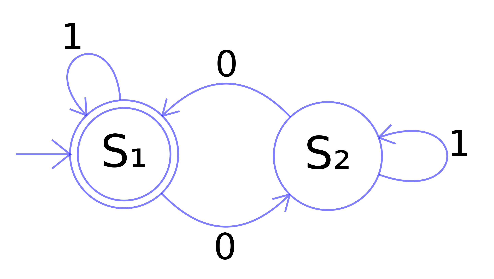
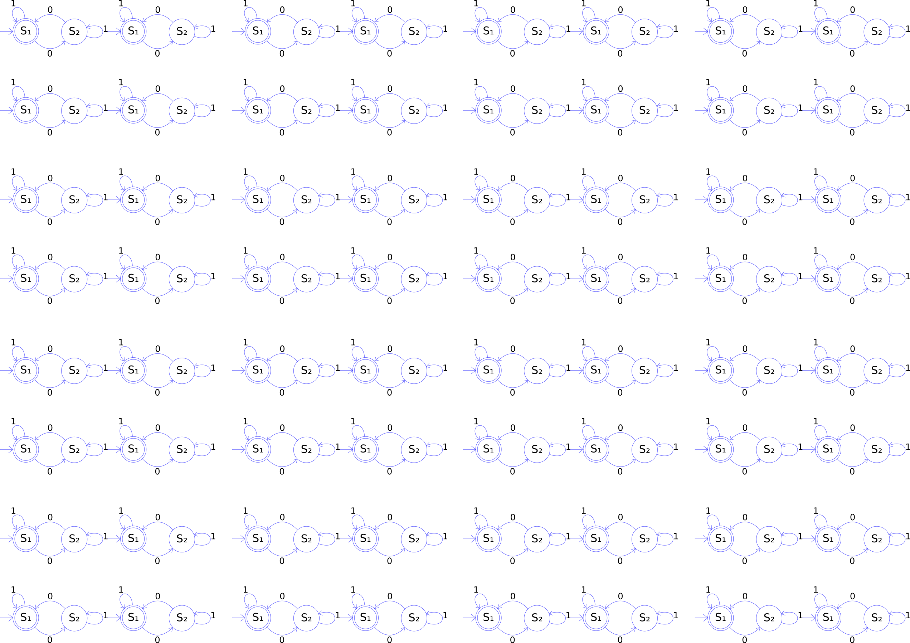
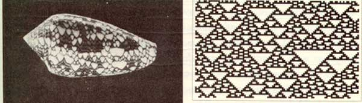
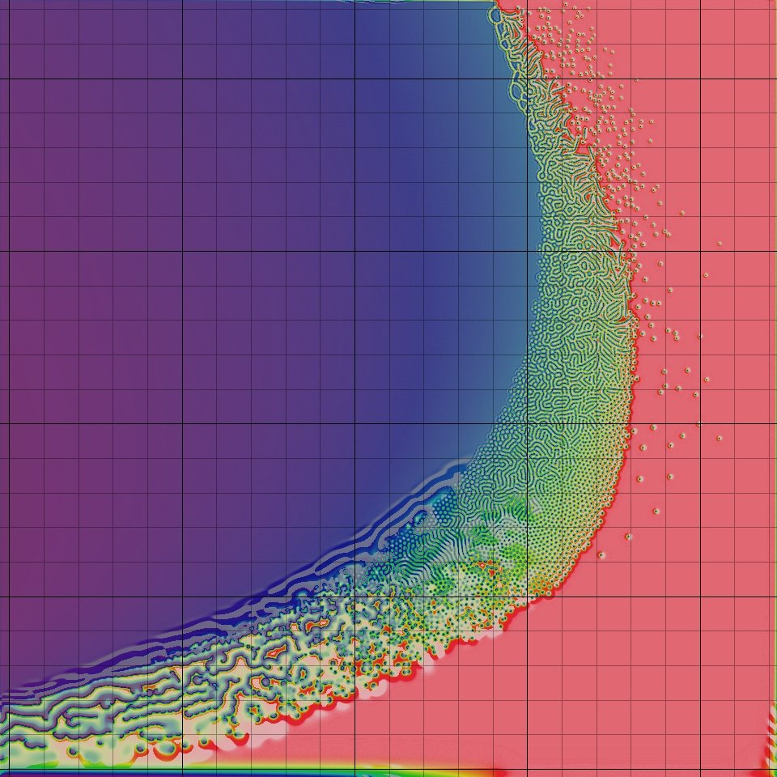
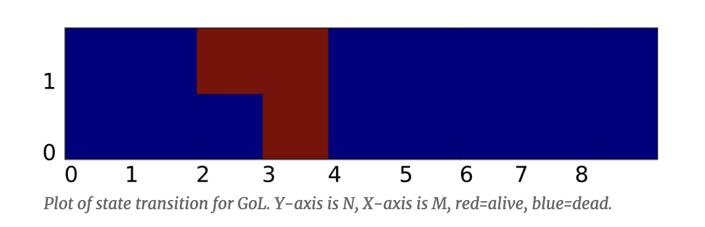
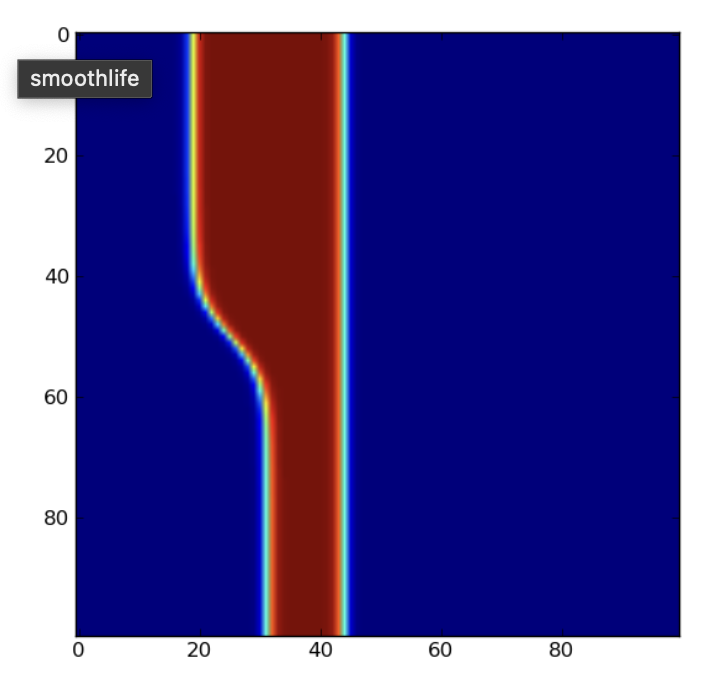
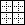
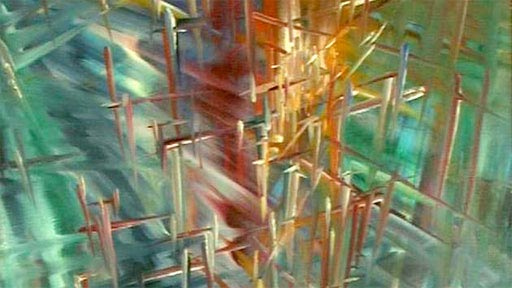

<!--{
	title: "Cellular Automata"
}-->

# Cellular automata (and related lattice models)



The mathematical notion of *automaton* indicates a discrete-time system with finite set of possible states, a finite number of inputs, a finite number of outputs, and a transition rule which gives the state at the next step in terms of the state and inputs at the previous step. 




A *Cellular Automaton* applies this notion in parallel to a cellular space, in which each cell of the space is a stateful automaton. 

Christopher Adami describes CAs as the first "artificial chemistries", since they operate as a medium to research the continuum between the inanimate (such as molecules in crystal and metalline structures) and the living (such as cells of a multi-cellular organism). Thus they can be used to model all kinds of information processing and development in biological systems, as well as questions of life's origins. (However the computational cellular systems we will visit are far, far simpler than biological cells.)


The CA model was propsed by Stanislaw Ulam and used by [von Neumann](https://en.wikipedia.org/wiki/Von_Neumann_universal_constructor) -- in the 1940's -- to demonstrate machines that can reproduce themselves. Decades later Christopher Langton proposed a more concise [self-reproducing CA](http://www.youtube.com/watch?v=2iDc4C6vbcc), which has since been further improved upon using artificial evolutionary techniques:

<iframe width="480" height="360" src="https://www.youtube.com/embed/vbpoTZlNTiw?rel=0" frameborder="0" allowfullscreen></iframe>

Stephen Wolfram, author of Mathematica, performed extensive research on CAs and uncovered general classes of behaviour comparable to dynamical systems. A commonly referenced example is his 'rule 30', which is a 1D CA displayed below as a stacked trace (history goes down) -- whose pattern is reminiscent of some naturally occurring shell patterns:



<iframe width="480" height="360" src="https://www.youtube.com/embed/jDguxopxyJk?rel=0" frameborder="0" allowfullscreen></iframe>

Here are some of the well-known 1D rules:

<p data-height="300" data-theme-id="18447" data-slug-hash="NeLQvY" data-default-tab="js,result" data-user="grrrwaaa" data-pen-title="1D Rules: 2019" data-preview="true" class="codepen">See the Pen <a href="https://codepen.io/grrrwaaa/pen/NeLQvY/">1D Rules: 2019</a> by Graham (<a href="https://codepen.io/grrrwaaa">@grrrwaaa</a>) on <a href="https://codepen.io">CodePen</a>.</p>
<script async src="https://static.codepen.io/assets/embed/ei.js"></script>

Wolfram divided CA into four classes, according to their long-term behavior:

- **Class 1** - stable. Evolves to homogeneous state.
- **Class 2** - cyclic. Evolves to simple separated periodic structures. Local changes to the initial pattern tend to remain local
- **Class 3** - chaotic. Any stable structures that appear are quickly destroyed by the surrounding noise. Local changes to the initial pattern tend to spread indefinitely
- **Class 4** - complex. Local changes to the initial pattern may spread indefinitely. Wolfram has conjectured that many, if not all class 4 cellular automata are capable of universal computation.

[Over here a 3D cellular automaton is taking over Minecraft](https://www.youtube.com/watch?v=wNypW-aSCmE), and [here is a self-replicating computer in 3D](http://www.youtube.com/watch?v=PBXO_6Jn1fs).

---

The essential components that define a cellular system are:

- **Cellular space:** A collection of cells arranged into a discrete lattice, such as a 1D strip, a 2D grid, or a 3D volume. 

- **Cell states:** The information representing the current condition of a cell. In binary CAs this is simply either 0 or 1.

- **Initial conditions:** What state the cells are in at the start of the simulation.

- **Neighborhood:** The set of adjacent/nearby cells that can directly influence the next state of a cell. The most common 2D neighborhoods are: 

- **State transition function:** The rule that a cell follows to update its state, which depends on the current state and the state of the neighborhood. It gives the cell state[t+1] as a function of the states[t] of itself and neighbours. 

- **Time axis:** The cells are generally updated in a discrete fashion, which may be synchronous (all cells update simultaneously) or asynchronous (cells update sequentially).

- **Boundary conditions:** What happens to cells at the edges of the space. A periodic boundary 'wraps around' to the opposite edge; a static boundary always has the same state, a reflective boundary mirrors the neighbor state.


[The wikibooks on CA](https://en.wikibooks.org/wiki/Cellular_Automata).

---

## Conway's Game of Life

The most famous CA is probably the **Game of Life**. It is a 2D, class 4 automata, which uses the Moore neighbourhood (8 neighbours), and synchronous update. The transition rule can be stated as follows:

- If the current state is 1 ("alive"):
	- If the neighbor total is less than 2: New state is 0 ("death by loneliness")
	- Else if the neighbor total is greater than 3: New state is 0 ("death by overcrowding")
	- Else: State remains the same ("alive")
- If the current state is 0 ("dead"):
	- If the neigbor total is exactly 3: New state is 1 ("reproduction")
	- Else: State remains the same ("dead")
	
> It is thus an example of a *outer totalistic* CA: The spatial directions of cells do not matter, only the total value of all neighbors is used, along with the current value of the cell itself. Note also that these rules mean that the Game of Life is not reversible: from a given state it is not possible to determine the previous state.

The Game of Life produces easily recognizable higher-level formations including stable objects, oscillatory objects, mobile objects and objects that produce or consume others, for example, which have been called 'ponds', 'gliders', 'eaters', 'glider guns' and so on. 

<iframe width="560" height="315" src="https://www.youtube-nocookie.com/embed/E8kUJL04ELA?start=76" frameborder="0" allow="accelerometer; autoplay; encrypted-media; gyroscope; picture-in-picture" allowfullscreen></iframe>

This CA is so popular that people have written [Turing machines](http://www.youtube.com/watch?v=My8AsV7bA94) and, recursively, the [Game of Life](http://www.youtube.com/watch?v=xP5-iIeKXE8) in it. 

[An homage in the NY Times](https://www.nytimes.com/2020/12/28/science/math-conway-game-of-life.html)


### Implementation

If the cells are densely packed into a regular lattice structure, such as a 2D grid, they can efficiently be represented as *array* memory blocks. The state of a cell can be represented by a number. 

> This is similar to the representation of an image as data -- a grid of pixel values, which are just numbers in a lattice.

The rules themselves can be translated pretty efficiently to procedural code, using if/else conditions. 

One complication is that the states of the whole lattice must update synchronously. A naive implementation will thus update cells one at a time, and the neighborhood of a particular cell will contain both 'past' and 'future' states. One way to work around this is to maintain two copies of the lattice; one for the 'past' states, and one for the 'future' states. The transition rule always reads from the 'past' lattice, and always writes to the 'future' lattice. After all cells are updated, either the 'future' is copied to the 'past', or the 'future' and 'past' lattices are swapped, since the future of yesterday is the past of tomorrow.  

> This technique is called *double-buffering*, and is widely used in software systems where a parallel process interacts with a serial machine. It is used to render graphics to the screen, for example.

### Why use the GPU?

In past years we have implemented our CAs using operations on buffers in the CPU, like this:

<p data-height="300" data-theme-id="18447" data-slug-hash="JwprVG" data-default-tab="js,result" data-user="grrrwaaa" data-pen-title="2019 DATT4950 Jan 3" data-preview="true" class="codepen">See the Pen <a href="https://codepen.io/grrrwaaa/pen/JwprVG/">2019 DATT4950 Jan 3</a> by Graham (<a href="https://codepen.io/grrrwaaa">@grrrwaaa</a>) on <a href="https://codepen.io">CodePen</a>.</p>
<script async src="https://static.codepen.io/assets/embed/ei.js"></script>

However the nature of CAs makes them incredibly suitable for implementation using GPUs:
- they are inherently massively parallel processes, working over grids of cells (like grids of pixels or texels)
- the same program runs on every single cell -- which is exactly how fragment shaders work

It turns out that by using GPU shaders, our cellular automata can run tends or even hundreds of times faster than on the CPU.  Or put another way, we can make them at much higher resolutions, or make them much more complex, and still get good update frame rates. 

So this year, we're going to implement our CAs using fragment shaders in GLSL.  GLSL is a way to write programs that will run directly on your GPU. GLSL can be used in the web like on ShaderToy, or in Three.js, or basically any web page in a modern browser -- even when opened on your phone or a VR headset like the Quest 3. GLSL is also used in desktop OpenGL envionments, including TouchDesigner, Max/MSP/Jitter, Ossia, Hydra, and so on.  It can also be used in Unity or Unreal, though they prefer you to use a more abstract language (HLSL) which then translates to GLSL. It is an incredibly useful skill for media arts today. 

A really convenient way to explore this is using [Shadertoy.com](https://www.shadertoy.com/), a browser-based editor and viewer for fragment shaders.  It's free to create an account so that you can save your shaders, and so long as you save them as "public", you can share them via the URL. Also, it's relatively easy to move shaders written in ShaderToy to other environments, such as Max/Jitter, TouchDesigner, Three.js, OpenFrameworks, Cinder, etc., and with a little more work, Unity, Unreal, Godot, etc. 

[A quick tutorial on GLSL in Shadertoy](glsl.html)

### Game of Life in GLSL

**Planning**
- How to initialize the field -- random on/off cells?
- The next frame is a function of the previous frame; so we need a Buffer for the feedback loop
- We will need an initialization event (frame zero? keyboard input?)
- We need to read neighbor pixels via coordinate operations
- Boundary conditions: we can use the **wrap** settings of the iChannel input, or define our own
- Texture values are floating points (0.0 to 1.0), but we need integer values (0 or 1), so we can count them. We can cast a comparison to integer (e.g. `int(N.x > 0.)`)
- Can we draw input with the mouse via `iMouse`?
- Can we rewrite it using `mat3` kernels?
- We actually have 4 values per pixel (R, G, B, A), but we are only using 1 right now.  Can we use the others to visualize something useful?
  
https://www.shadertoy.com/view/w3dyDN

**Questions**

- Can you try different thresholds of neighbors for death and rebirth? Do you get complex behaviour, or one of Wolfram's other classes?  Can you figure out what the rules need to be complex?

- Will it run forever?

A *backround noise* can be added, such that from time to time a randomly chosen cell changes state. Try adding background noise to the Game of Life to avoid it reaching a stable or cyclic attractor. But too high a probability and it descends into noise. Try adding a *temperature* control to control the statistical frequency of such changes. Could something *intrinsic* to the system determine temperature? Could this vary over space?

---

## Variations

Starting from this basis, what do you think would be interesting to change?  

More variations are possible by modulating the basic definition of a CA, some of which have been explored more than others. 

Look at the basic definition of CAs we saw above, and think: what could be varied from how the Game of Life works, but still be within the definition of a CA?  What do you think we could change to make it more interesting?  

Your Assignment 1 will a novel Cellular Automata of your own design & invention, implemented using Shadertoy. 

---

### Brian's Brain

Game of Life has only two states, 0 and 1, but we could have more states. For example, in the "Brian's Brain" CA, there are 3 states, which we typically encode as `1.0` (activated), `0.5` (decaying), and `0.0` (off).

The rules are simple: 
- If we are activated (1.0), we decay to 0.5 (decaying).  
- If we are off (0.0) but exactly 2 of our 8 neighbors are activated, we also reactivate to 1.0. 
- Otherwise, we turn off (0.0)

It's pretty easy to build this if we start from the Game of Life. 

https://www.shadertoy.com/view/t3tcDN

### HodgePodge

The HodgePodge CA also has three named states -- "healthy", "infected", and "sick", -- but one of them ("infected") includes a whole range of possible values: 
- 0.0 means healthy
- 1.0 means sick
- Any other values between 0.0 and 1.0 mean infected but not yet sick. 

(In the reference implementation, there are 254 possible values of increasing infection, so this is actually a 256-state automaton.)

The transition rule is a bit more complex:
- If we are sick (1.0)
  - We automatically heal to 0.0
- If we are infected
  - We continue to be infected, with some factors depending on the average level of infection and sickness in our neighborhood
- If we are healthy
  - We become infected with some different factors depending on the average level of infection and sickness in our neighborhood

Despite the terminology of infection & sickness, this really isn't a good model of contagion; but what it does is quite strange and interesting. 

Can you predict from the algorithm what it might do? Let's look at the code a bit first, before we run it.  

https://www.shadertoy.com/view/3XcyRs

This system typically goes through several stages:
- first a mass pulsing, more or less synchronized with a textured brain-like pattern
- then circular pulsing pockets begin to appear and grow, with waves pushing to larger regions at different phases
- then spiral patterns begin to appear and overcome the still growing pulsations
- then the spirals break down under their own advection into smaller spirals while the bigger waves consume the remaining space

The crucial parameter to vary these behaviors is the sickness rate.

The spiral patterns here are characteristic of Reaction Diffusion systems, which we will explore further later. 

See http://www.sciencedirect.com/science/article/pii/016727898990081X#


## Spatially Non-homogenous CA

Spatial inhomogeneity can be interesting to simulate different geographies (such as boundaries). The simplest option is to prime the system with inhomogeneous initial conditions, but these differences can quickly dissapear, whereas varying other components of a CA spatially can have more profound results (though, as with randomness, care may need to be taken that these differences do not overly dominate the process).

CA can be further varied with other spatially non-homogenous properties, such as:

- Creating unusual neighbourhoods (or simply, non-totalistic ones) can introduce interesting spatial biases to behaviour.
- Special *boundary* cells in the field may follow different rules from others.
- Changing parameters, such as statistical probabilities, over space.
- Some rules may depend on the cell position; perhaps the same CA has different regions using different rules. These can be implemented by changing the function used in the transition rule, or parameterizing that rule based on the current region.

What happens if the regions are moving?

https://www.shadertoy.com/view/t33cWs

https://www.shadertoy.com/view/wXGcRW

## Temporally Non-homogenous CA

Temporal non-homogeneity can be used to perform a sequence of different filters, or otherwise help to build long- as well as short-term arcs of behaviour.

- The neighborhood selection rules could change over time.
- The rules used could alternate between different rule definitions, over a period of N frames. 
  - Can you modify the "Game of Brains" example above to do this? What values of N are more interesting? Why?
- Or certain parameters to rules could cycle over certain periods. Scott Draves' [Bomb](http://scottdraves.com/bomb.html) modulated parameters continuously, with different rule sets picking up the last as their new initial conditions.
- Variations of space/rule/neighborhood could depend on global conditions, such as the overall density of black and white cells, or due to user interactions.
- Other combinations of the above (and below)

Are these variations sometimes still equivalent to a slightly more complex, but temporally homogenous, CA?

<!--

## Asynchronous CA

Rather than updating all cells at once, some other policy of visiting cells to update is applied.

- A fixed update policy, such as linear scan or pre-determined path, is orderly, but may introduce artifacts (related to the *double-buffering* pattern). A randomized, but still fixed, order can still lead to artifacts.

- A multi-rate CA (self-clocked) updates each cell according to a clock period that varies from cell to cell. This implies that each cell must have more than one value (one to store the state, one to store the period, one to store the phase) -- or equivalently, that there is more than one cellular grid. The clock period or phase could be affected by that of neighbours'. This may lead to *entrainment* effects. 
- Mobile CA (see below)
- Probabilistic asynchrony (see below)

-->

## Mobile CA

A *mobile CA* has a notion of active cells. The transition rule is only applied to active cells, and must also specify a related cell (such as one of the neighbors) of the current active cell as the next active cell. (This could also be partly probabilistic.) 

There could be more than one 'active cell' -- there could even be a list of currently active cells. Non-active cells are then described as "quiescent". But what happens if two active cells occupy the same site?

### Langton's Ant

- [Langton's Ant](http://en.wikipedia.org/wiki/Langton%27s_ant) is a mobile CA in a 2D, two-state space, with very simple rules:
	- At a white square, turn 90° right, flip the color of the square, move forward one unit
	- At a black square, turn 90° left, flip the color of the square, move forward one unit


See our old JavaScript version here:

<p data-height="300" data-theme-id="18447" data-slug-hash="RWrdoq" data-default-tab="js,result" data-user="grrrwaaa" data-pen-title="Langton's Ant: 2019" data-preview="true" class="codepen">See the Pen <a href="https://codepen.io/grrrwaaa/pen/RWrdoq/">Langton's Ant: 2019</a> by Graham (<a href="https://codepen.io/grrrwaaa">@grrrwaaa</a>) on <a href="https://codepen.io">CodePen</a>.</p>
<script async src="https://static.codepen.io/assets/embed/ei.js"></script>

At this slow speed, it doesn't seem like anything interesting is going to happen. It looks like it will gradually turn everything into noise. 

But if we speed it up (by running more than one simulation step per frame), something unexpected happens!

The [original video by Christopher Langton](http://www.youtube.com/watch?v=w6XQQhCgq5c), including examples of multiple ants (and music by the Vasulkas):

<iframe width="480" height="360" src="https://www.youtube.com/embed/w6XQQhCgq5c?rel=0" frameborder="0" allowfullscreen></iframe>

---youtube:w6XQQhCgq5c

It is interesting seeing what happens with more than one ant in the space:

<p data-height="300" data-theme-id="18447" data-slug-hash="LMJwVP" data-default-tab="js,result" data-user="grrrwaaa" data-pen-title="Multiple Langton Ants: 2019" data-preview="true" class="codepen">See the Pen <a href="https://codepen.io/grrrwaaa/pen/LMJwVP/">Multiple Langton Ants: 2019</a> by Graham (<a href="https://codepen.io/grrrwaaa">@grrrwaaa</a>) on <a href="https://codepen.io">CodePen</a>.</p>
<script async src="https://static.codepen.io/assets/embed/ei.js"></script>
		
How would we implement this in GLSL? Let's start with what data is in each cell:
- The cell value (0 or 1)
- Is there an ant present? (0 or 1)
- What direction is the ant traveling? (e.g. 0, 0.25, 0.5, 0.75 for E, N, W, S?)

The rules are more difficult to implement. They are described as being 'from the point of view of the ant', but in shader programming, we have to think of things 'from the point of view of the pixel'.  What activities can change our pixel's current values?
- Ants are always moving. If the current pixel had an ant, that ant has now gone. 
- We have to check our neighbors to see if they have an ant that is moving into us. For example, if the cell to the North has an ant that is moving South, then it moves into us, flips the color, and sets a new direction. 

https://www.shadertoy.com/view/W33yRS

We can't easily speed this up. Starting from one ant, it takes over a minute for the structure to appear. But what we can do is seed it with thousands of ants! 

### Termites

Mitchel Resnick's termite model is a random walker in a space that can contain woodchips, in which each termite can carry one woodchip at a time. The program for a termite looks something like this:

- Look at the space just in front of me
- If it is empty, move forward and randomly change direction (random walk)
- Else if it is occupied by a woodchip:
	- If I am carrying a wood chip, drop mine where I am and turn around
	- Else move forward and pick up the woodchip
	
Over time, the termites begin to collect the woodchips into small piles, which gradually coalesce into a single large pile of chips.

This is a trickier model to implement in GLSL -- it takes careful attention to movement of cells to make sure the number of termites does not accidentally increase!  But it's the same basic idea as Langton's Ant.  Remember: the fragment shader program is always from the perspective of the cell (not the ant/termite): a cell needs to know if a termite is entering it from a neighbor, or if a termite currently in the cell will remain there. If neither of those cases are true, then the cell will end the frame with no termite present. 

https://www.shadertoy.com/view/33cyRS

-----------

## Probabilistic/Stochastic CA

A stochastic CA uses some kind of (pseudo-)random probabilities of change in the transition rules. This could be to emulate real-world systems that are subject to probabilistic or chance-based factors.  It may also help avoid the CA falling into a stable or cyclic pattern -- but at the same time, it also runs the risk of descending into uninteresting noise.

### Pseudo-randomness

Why do we call it "pseudo-" random?  

Take a look at how our `random4` function is written in GLSL:

```glsl
// given a vec3 input seed, return a pseudorandom vec4
vec4 random4(vec3 p) {
    vec4 p4 = fract(p.xyzx * vec4(.1031, .1030, .0973, .1099));
    p4 += dot(p4, p4.wzxy + 19.19);
    return fract((p4.xxyz + p4.yzzw) * p4.zywx);
}
```

Given the same input seed, the `random4()` function will do some math that is **completely deterministic**, which means, it will compute the same result every single time.   (Here, `fract` simply returns the fractional component of a number, and `dot` is the dot product, which multiplies each of the vec4 components of its arguments, then sums them up. This all boils down to multiplications, additions, and divisions.)  

**There is nothing random in this at all!**  Or rather, it is only as random as the input seed is.  Typically we seed it with something dependent on space and time, such as `vec4 noise = random4(vec3(fragCoord, iTime))`, to ensure the seed value is unique per cell and per frame. But that is still not random! 

The nature of the math however has two important properties that make it very useful to us:
- **For any particular input seed, it is very difficult to predict what the output value would be, without actually doing the math**.  It is **unpredictable** even though it is not random. 
- Given a random input seed, the output value is roughly equally likely to be in any particular place between 0.0 and 1.0. That is, over enough time, the **range of output values is equally distributed**.  
 
This is similar to rolling a dice: any particular face of the dice is equally likely to come up (**flat distribution**), but you have no idea which one it will be without doing the actual physics of rolling the dice (**unpredictable**).   

So, even though our generator is not truly random, so long as we keep using unique seeds, it is unpredictable and equally likely to be anywhere in the output range.  

Most of the time this is good enough to create the appearance of randomness -- but it is important to remember that we shouldn't trust it to be truly random. In simulation sciences, the choice of random source, and the diversity of seeds used, can be incredibly important to ensure the validity of any conclusions drawn.  A poor pseudo-random generator may also manifest patterns in the output (where the distribution and colour is no longer flat), or may not completely cover all values in the distribution, for example. 

### Forest Fire

Let's look at some example CAs using probabilistic rules.  

The Forest Fire model below has three states: a cell can be "empty", "tree", or "burning".  

- If a cell is "empty", there is a chance that a seed blown in the wind landed here, and becomes a new "tree"
- If a cell is "empty" but there are cells next to it that are "tree", there is a chance that the trees grow larger and this cell also becomes a "tree"
- There is a chance that a "tree" is struck by lightning and becomes "burning". 
- If a cell is a "tree" and there are cells nearby that are "burning", there is a chance that this tree catches fire and is also now "burning"
- If a cell is burning, there is a chance that rain falls and puts the fire out, so it becomes "empty" again. 

So we five several probability thresholds here: Chance of spore; Chance of growth; Chance of lightning; Chance of fire spreading; Chance of rain;

Here's this model runing in a Javascript simulation. It can be interesting to change the probabilities to see how it behaves:

<p data-height="300" data-theme-id="18447" data-slug-hash="OroeKW" data-default-tab="js,result" data-user="grrrwaaa" data-pen-title="Forest Fire: 2019" data-preview="true" class="codepen">See the Pen <a href="https://codepen.io/grrrwaaa/pen/OroeKW/">Forest Fire: 2019</a> by Graham (<a href="https://codepen.io/grrrwaaa">@grrrwaaa</a>) on <a href="https://codepen.io">CodePen</a>.</p>
<script async src="https://static.codepen.io/assets/embed/ei.js"></script>

Unfortunately, this one poses a few challenges to translate to GLSL, because of the extremely low numbers we need for the probability tests. The reason is limits of floating point resolution on the GPU, and the quality of the random number generator we have availble in our GLSL code.  Simply put, if the probability threshold is too low, it no longer seems to make any difference.  Compare the output for example of these:

```glsl
vec4 noise = random4(vec3(fragCoord, iTime));
fragColor = vec4(noise.x < 0.1);
fragColor = vec4(noise.x < 0.01);
fragColor = vec4(noise.x < 0.001);
fragColor = vec4(noise.x < 0.0001);
fragColor = vec4(noise.x < 0.00001);
```

At a certain point, the outputs look the same. Why?

We can work around this limitation by applying our probability tests against two values at the same time:

```glsl
fragColor = vec4(noise.x < 0.001 && noise.y < 0.001); 
```

This is like testing against 0.000001, because 0.001 x 0.001 = 0.000001.

With that, we can write the Forest Fire model with the very low probabilities we need:

https://www.shadertoy.com/view/tXdcDN

Play with different values to see what you find.  There can be temporal and spiral oscillations hiding in here, if you can find them.

### Contact processes

The key factor in a probabilistic model is how you calculate the probability of a change.  In the forest fire model, these were simply constants, but are only tested according the presence of particular types of neighbors (burning trees, empty land, etc.). 

In many probabilistic models, the probability of a change depends on the local difference of a cell from its neighbors. So, instead of using if/else conditions along with probabilities, we **only** use probabilities. This kind of model is sometimes called a [contact process](https://en.wikipedia.org/wiki/Contact_process_(mathematics)) model. It can be used to model the spread of infection, voter bias, or behaviours of fundamental physics. 

A simple infection model, for example:
	- infected sites become healthy at a constant probability
	- healty sites become infected at a probability proportional to the number infected neighbours

Could you implement this?  Could you extend it to incorporate effects of vaccination, social distancing, multiple diseases, etc.? 

(This is not the same as the [Hodgepodge](#hodgepodge) we saw above -- that one was completely determinsitc, not stochastic.)

Let's start from something simpler:

### Ising model

The *Ising model* of ferromagnetism in statistical mechanics models the probability of a point in space flipping between positive or negative spin.  The probability of this change happening depends on the **local entropy**: the probability is higher if the change of state would move the site closer to energetic equilibrium with its local neigborhood. That is, **nearby cells are more likely to become the same than to become different**.

However, there is also an increasing chance of a site changing state randomly, according to the **temperature**. 

**This implies two opposing tendencies, one diffusion like and convergent, which promotes order (entropy reduction), and one destructive, which induces divergent chaos (temperature).**

To implement this, we need to think about each element in turn:

- **State** ("spin") is either 0 or 1. This is actually our only cell value. However, we can use the other channels of our pixel to capture more information about the system, so that we can visualize it in the final image. 

- For **neighborhood** we could use the Moore region of 8 neighbors, just like the Game of Life. 

- **Temperature** is just a parameter, which we could say is between 0.0 and 1.0.  Perhaps it is a constant, or perhaps we might try varying it over time, over space, by mouse interaction, etc.  

- The **entropy** could be modeled as the proportion of neighbors that are in a **different** state (0.0 if all the same, 1.0 if all different).  This is a bit of a simplification of the physics, but it captures the essence of it. 

- From these we compute the **probability of change**, between 0.0 and 1.0.  Change should be more probable if entropy is high, and also if temperature is high. The physically correct way to calculate this uses Hamiltonians and some more complex math, but we can use a simpler approximation. I found that `pow(entropy, 1./temperature)` gives decent outcomes.  See https://www.desmos.com/3d/cgr7h3xbyd 
  
- Then the transition rule is simple: if a random (noise) value is less than the probability, flip the cell's state. 

Try mapping temperature over space, e.g. using `uv.x`. Or mapping it to the proximity to the mouse, to create hotspots. 

As is often the case, it can be interesting to visualize different parts of the system in the final shader using different colours. For example, we use this to visualize the entropy, temperature, and probability. 

https://www.shadertoy.com/view/tXtcz2

At high temperatures, the system remains noisy, while at lower temperatures it gradually self-organizes into grouped zones with equal spin.  This idea of a **temperature control** generalizes to many kinds of systems. 

<!--
A simplified Ising model on codepen -- try changing the temperature:

<p data-height="300" data-theme-id="18447" data-slug-hash="wREVKe" data-default-tab="js,result" data-user="grrrwaaa" data-pen-title="Simple Ising: 2019" data-preview="true" class="codepen">See the Pen <a href="https://codepen.io/grrrwaaa/pen/wREVKe/">Simple Ising: 2019</a> by Graham (<a href="https://codepen.io/grrrwaaa">@grrrwaaa</a>) on <a href="https://codepen.io">CodePen</a>.</p>
<script async src="https://static.codepen.io/assets/embed/ei.js"></script>

<p data-height="300" data-theme-id="18447" data-slug-hash="bOxXEo" data-default-tab="js,result" data-user="grrrwaaa" data-pen-title="HodgePodge: 2019" data-preview="true" class="codepen">See the Pen <a href="https://codepen.io/grrrwaaa/pen/bOxXEo/">HodgePodge: 2019</a> by Graham (<a href="https://codepen.io/grrrwaaa">@grrrwaaa</a>) on <a href="https://codepen.io">CodePen</a>.</p>
<script async src="https://static.codepen.io/assets/embed/ei.js"></script>
-->

### Large/unbounded/complex states

The cellular *Potts model* (also known as the *Glazier-Graner* model) generalizes probabilistic CA beyond the two states of the Ising model to allow more states, and in some cases, an unbounded number of possible site states; however it still utilizes the notion of statistical movement toward neighbor equilibrium to drive change, though the definition of a local entropic differene (the Hamiltonian). Variations have been used to model grain growth, foam, fluid flow, chemotaxis, biological cells, and even the developmental cycle of whole organisms. 

How would we need to change the Isnig model to have more than 2 states?
- Initialize the field not just with 0 and 1, but with several possible values, e.g. 0.0, 0.2, 0.4, 0.6, 0.8.  
- When a cell is to change value, it should copy the value of one of its neighbors, selected at random.  

One way to initialize the cell values is using e.g. `floor(noise.x * 5.) / 5.`. 

To select a random neighbor, we could either generate a new texture lookup with a random offset. Or, we could store all our neighbors in an array, and pick one at random. E.g.:

```glsl
// store neighbors in array:
float near[8] = float[8](N.b, E.b, S.b, W.b, NW.b, SW.b, NE.b, SE.b);
// pick a cell at random:
int idx = int(noise.z * 8.);
// copy their state
C.b = near[idx];
```

This starts to look a bit like a map of provinces, or perhaps something like foam. 

Again, visualize the entropy, probability, and moments of change. 

What if we allowed the states to be *any* value between 0.0 and 1.0 -- seeding the state with `noise.x`?  It starts to look even more like foam! 

https://www.shadertoy.com/view/W3dyWl

This would be a great starting point for more exploration! Here's one in which I modified the entropy to take into account relative differences of state, and modifed the update rule to also introduce a mutation of state each time: https://www.shadertoy.com/view/tXVyRV 

States need not be limited to single numbers -- in other systems the state could be represented by an n-tuple of values, or a recursive structure allowing unbounded complexity. Stan Marée, Paulien Hogeweg and Alexander Panfilov used this model to simulate the whole life cycle of [Dictyostelium discoideum](https://www.researchgate.net/publication/46594643_Phototaxis_during_the_slug_stage_of_Dictyostelium_discoideum_A_model_study) -- see the [webpage here](https://tbb.bio.uu.nl/stan/Thesis/Thesis/node7.htm), e.g. Fig 4.1c.  This is all a cellular automaton! 

## Continuous state & function CA

Now we have seen a few examples of CA that use continuous-valued states (e.g. any number between 0.0 and 1.0), and some more mathematical transition rules (rather than if/else conditions).  Let's see some more. 

### Reaction Diffusion

The reaction-diffusion model was proposed by Alan Turing (shortly before his passing) to describe embryo development and pattern-generation ([Turing, A. The Chemical Basic for Morphogenesis.](http://www.dna.caltech.edu/courses/cs191/paperscs191/turing.pdf)). His RD systems were presented as continuous functions in mathematics, but they can be approximated using cellular automata with continuous-ranged values. This is still used today in computer graphics -- a landmark publication being [Greg Turk's famous paper](http://www.cc.gatech.edu/~turk/my_papers/reaction_diffusion.pdf) paper on animal pattern generation using cellular automata across meshes. 

Let's look at a simple RD system. [Here's a clear explanation of one on Karl Sims' website](https://www.karlsims.com/rd.html).

The chemical interpretation:

- A's are constantly added.  A's diffuse quickly through the space.  
- B's are constantly removed. B's diffuse too, but more slowly than A. 
- Two B's plus one A causes a chemical reaction that turns the A into a B (so you get 3 B's at the end)

That's a discrete description, but we'll assume that a pixel could contain thousands or millions of A's and B's, so instead we'll model them in a continuous way as "concentrations". So our cell state is two numbers, for the concentrations of A and B. 

The update rule applies the reaction equations for both A and B. These are "rate of change" equations, so they add to (or remove from) the existing concentrations.  Here's are the two rates of change:

- Change of A = (Diffusion inflow of A) - (Reaction product removal of A) + (Feed rate of A)
- Change of B = (Diffusion inflow of B) + (Reaction product addition of B) + (Kill rate of B)

The **Reaction Product** change is the same in both cases. Since it takes two B's to make an A, it is `A * B * B`. 

The **feed rate** is proportional to existing A, using `feedrate * (1.0 - A)`, which ensures A is never > 1.0.  Typically in the range of from 0.01 to 0.1. 

The **kill rate** uses `(killrate + feedrate)*B` to ensure the kill rate is never less than the feed rate.   Typically in the range of from .045 to 0.07. 

The most complex part is the diffusion. The basic idea is that, over time, any chemical becomes more evenly distributed in space. That's a bit like what a blur does. However, for diffusion it is **essential** that this is done in such a way that the total quantity over space does not increase or decrease, i.e. it is "mass preserving".  (Otherwise, the system could easily just blow up in an unrealistic way!) 

We can implement this as a filter kernel, to find out for a given cell, how different its average neighborhood is. In Karl Sims' webpage, he suggests using a 3x3 kernel like so:

```glsl
      0.05, 0.2, 0.05,
      0.2,  -1,  0.2,
      0.05, 0.2, 0.05
```

Notice that if you add up all of these values, the sum total is zero.  That is what ensures that this kernel is mass preserving.  Here's how we could do this in GLSL:

```glsl
	// assumes we have already got C, N, E, S, W, etc. like we did in many other shaders:
	vec4 diffusion = 0.05*(NE+NW+SE+SW) + 0.2*(N+E+S+W) - C;
```

Or if you want a more programmatic way:

```glsl
	mat3 kernel = mat3(
      0.05, 0.2, 0.05,
      0.2,  -1,  0.2,
      0.05, 0.2, 0.05
    );
    // loop over a 3x3 region, summing results:
    vec4 diffusion = vec4(0.0);
    for (int i = -1; i <= 1; i++) {
        for (int j = -1; j <= 1; j++) {
            // get the image at this texel:
            vec4 value = texture(iChannel1, (fragCoord + vec2(i,j)) / iResolution.xy);
            // Apply kernel weight and sum:
            diffusion += value * kernel[i+1][j+1]; 
        }
    }
```

With that, we have *almost* enough to build our first RD system. 

But what should the **initial conditions** be? I find that this system can be quite sensitive to start conditions, and can easily blow up.  I find that starting with a field full of A's and a few blobs of B here & there is a good starting point. 

https://www.shadertoy.com/view/W3dyDl

---


> Interpretation: There are two parts to this system: an "activator" and an "inhibitor".  Both diffuse over space, but the activator diffuses more slowly, leading to local-scale positive feedback, but longer-range negative feedback.

> This isn't the first time we have had a system that has balanced two different tendencies. Can you see any parallels with, for example, the Game of Life, or the Ising Model?

---

Some classic parameters for specific behaviours:

```
Mitosis     : killrate = 0.062 ; feedrate = 0.028
Solitons    : killrate = 0.060 ; feedrate = 0.030
Flowers     : killrate = 0.062 ; feedrate = 0.055
Finger      : killrate = 0.060 ; feedrate = 0.037
U-Skate     : killrate = 0.061 ; feedrate = 0.062
Mazes       : killrate = 0.057 ; feedrate = 0.029
Spirals     : killrate = 0.047 ; feedrate = 0.014
```

This system is also known as the *Gray-Scott* model, as described in [Pearson, J. E. Complex Patterns in a Simple System](http://arxiv.org/pdf/patt-sol/9304003.pdf). An optimized browser-based example is [here](https://pmneila.github.io/jsexp/grayscott/).  Another implementation in Shadertoy: https://www.shadertoy.com/view/ldXBz8

There is [a wonderful archive of this model at this webpage](http://mrob.com/pub/comp/xmorphia/), including many great video examples of the [u-skate world](http://www.youtube.com/watch?v=F5oKgVZ6bTk), and even [u-skate in 3D](http://www.youtube.com/watch?v=B03lcPEmSOQ). 



Some of the results share resemblance with analog video feedback ([example](http://www.youtube.com/watch?v=hDYEVv9t32U), [example](http://www.youtube.com/watch?v=Uw5onuS2_mw)), which has been exploited by earlier media artists (notably the Steiner and Woody Vasulka). 

---

### Multipass

The results are good, but the diffusion is quite slow -- maximum one pixel per frame for the faster chemical.  If you want to play with faster reaction-diffusion systems, you'll need to use a way of diffusing over wider ranges. You can try using larger kernels, such as a 5x5 kernel for up to two pixels per frame. But that means 25 texture lookups per pixel. This quickly gets very expensive.  Another option is to run several passes per frame. 

We can do this in Shadertoy by using several Buffer passes in a loop A -> B -> C -> D -> A etc. To save us writing the same code four times, we can re-write it as a function in the Common tab and re-use that in each Buffer tab.

https://www.shadertoy.com/view/33GyRc

### Extensions

Karl Sims has suggestions for exploring variations -- maybe these are interesting for us to try?

- Orientation: diffusion can occur faster in one direction than another to give an orientation to the results.
- Style Map: the feed and kill rates can vary across the grid to give different patterns in different areas.
- Flow: the chemicals can flow across the grid to give various dynamic effects.
- Scale: the size of the pattern changes when the reaction rate is sped up or slowed down relative to the diffusion rate.

It might be interesting to see what bringing external textures (or video streams) in as influences might do. 

<!--

Here is this model at a lower resolution using our starter kit:

<p data-height="300" data-theme-id="18447" data-slug-hash="roZXmR" data-default-tab="js,result" data-user="grrrwaaa" data-pen-title="Reaction Diffusion: 2019" data-preview="true" class="codepen">See the Pen <a href="https://codepen.io/grrrwaaa/pen/roZXmR/">Reaction Diffusion: 2019</a> by Graham (<a href="https://codepen.io/grrrwaaa">@grrrwaaa</a>) on <a href="https://codepen.io">CodePen</a>.</p>
<script async src="https://static.codepen.io/assets/embed/ei.js"></script>

-->

### Implementing a simplified Reaction Diffusion via blur

It's still a little frustrating that the diffusion is expensively slow. 

> Another option for larger kernels is to apply the diffusion as two separate passes: one pass diffuses horizontally, the second pass diffuses the result vertically (again, in Shadertoy this would mean using two Buffer passes). This two pass (horizontal, vertical) structure is often how high [quality blur shaders work](glsl.html#gaussian_blur). 

The thinking goes like this: To simulate diffusion at a given cell, we want the average value of all grid locations within a fixed radius of that cell. Averaging over a larger radius corresponds to having a faster diffusion rate, because there are more cells contributing to the new value. 

One of the most common methods to compute an average over an area is to take the Gaussian convolution. A neat feature of the Gaussian convolution kernel is that it is mass-preserving (also known as brightness-preserving or intensity-preserving). Each output pixel value is a weighted average of its neighbors. The kernel of weights is normalized, meaning the sum of all its values (weights) equals 1. Because the sum of the weights is 1, the total intensity (or "mass") of the image remains constant. And the Gaussian blur decays exponentially with distance, so it actually makes a workable model for diffusion. 

The problem is, it is very expensive. To get a deep blur (or fast diffusion) we need to average over many pixels, which means we need to do a huge number of computations. But there's a neat trick we can use here that is often used for efficient blur image processing. Another neat feature of a gaussian function is that the product of two Gaussian functions is a Gaussian, and the convolution of two Gaussian functions is also a Gaussian.  This means that we can apply a gaussian convolution blur in one axis only (say, only horizontally in the X axis), and then to the result of this, apply another Gaussian in the other axis (say, only vertically in the Y axis), and the final result we get here is a Gaussian blur in two dimensions. This two pass (horizontal, vertical) structure is often how high [quality blur shaders work](glsl.html#gaussian_blur). In Shadertoy, we can do this by using two Buffer passes. 

> (This two-pass diffusion or regional average technique will also help us with some other continuous automata.)

With a workable mass-preserving Gaussian blur convolution, we can turn that into diffusion just by running it in a feedback loop. If we repeatedly apply our blurs in feedback over many frames, it will become more and more diffused over the space.  

Now, the core pattern-generating capacity of a reaction diffusion system is the way that one chemical diffuses more quickly than the other.  We can model that by applying two blurs, one with a larger radius than the other. In the Turing reaction, activators and inhibitors diffuse at different rates, which corresponds to taking averages over different radii.

To model the reaction, then we just need to take the difference between the two chemicals. This is just like the subtraction of a smaller blur from a larger blur!

In fact this can be modeled with only 1 value -- think of it as representing the proportion between chemical A and chemical B.  If the reaction difference is positive, our proportion of A:B goes up; if the reaction difference is negative, our proportion of A:B goes down.  

So we have one channel representing a proportion of A:B, two blurs of this at different radii, and the difference of the blurs tells us whether the proportion should increase or decrease.  Amazingly that is also enough to produce Turing-style patterns! 

You can also try adding a little bias to the proportion on every frame, to emulate the case of one chemical being constantly fed into the system. 

https://www.shadertoy.com/view/33cBz4

What else can you think of that might be interesting to do with this?


<!--


### Multi-scale Turing Patterns

<iframe src="https://player.vimeo.com/video/137778082" width="720" height="405" frameborder="0" webkitallowfullscreen mozallowfullscreen allowfullscreen></iframe>

[Jonathan McCabe's cyclic multi-scale Turing patterns](http://www.jonathanmccabe.com/), and a [commentary by Mitchell Whitelaw](http://teemingvoid.blogspot.kr/2007/02/jonathan-mccabe-very-cellular-automata.html). The implementation is described [in this paper](http://www.archive.bridgesmathart.org/2010/bridges2010-387.pdf).

It starts with a straightforward reaction-diffusion system:

- Diffusion is simulated by averaging the continuous cell values over small (activator) and large (inhibitor) radii; if the the smaller (activator) concentration is greater than the larger (inhibitor) concentration, increase the cell value by a small amount; otherwise decrease. 
- After running the rule over all cells, the entire field is *normalized* (to ensure the minimum cell value is zero and the maximum cell value is 1).

Since this creates structure at a single spatial scale, it can be elaborated by super-imposing several models at different spatial scales (different small and large radii). Or, by changing the radii dynamically over time (as in [Greg Turk's famous paper](http://www.cc.gatech.edu/~turk/my_papers/reaction_diffusion.pdf)). McCabe's system uses several pre-defined scales, but selects which scale to apply for a particular cell according to which one currently shows the least local variation. 

Additionally, his system does not measure all cells within a radius; instead it selects cells at the radius distance and certain angular directions, creating cyclical symmetries in the result. For example, 3-fold symmetry may be used at a smaller scale, and 9-fold symmetry at a larger scale.

<iframe width="640" height="360" src="https://www.youtube.com/embed/4Sz-iEdNFDc?rel=0" frameborder="0" allowfullscreen></iframe>


References:
- https://softologyblog.wordpress.com/2011/07/05/multi-scale-turing-patterns/
- https://foo.net/projects/turing-clouds/background.html
- https://rreusser.github.io/multiscale-turing-pattern-gallery/
- https://www.semanticscholar.org/paper/Cyclic-Symmetric-Multi-Scale-Turing-Patterns-McCabe/2bbce66e648b5f6c27df147230872a16eafd21fa
- http://www.archive.bridgesmathart.org/2010/bridges2010-387.pdf
- https://vimeo.com/521001744
- https://observablehq.com/@rreusser/multiscale-turing-pattern-bot-v2
Of course, someone has ported McCabes model to GLSL: https://www.shadertoy.com/view/MdGGzR

-->

------------

## Fully continuous automata

Is it possible to completely eliminate discreteness in all aspects, to create a truly continuous CA?  

Take for example the Game of Life -- it is entirely discrete:  

1. states are discrete, either `0` or `1`
2. the definition of "self" is hard-edged: a single cell. Similarly, the definition of "neighbourhood" is also hard-edged: the 8 nearest cells
3. the transition function is a combination of discrete `if`/`else` rules, combined with discrete `>` and `<` comparisions. 
4. the way time passes is discrete, with cells either flipping or not flipping state

Is it at all possible to turn all these discrete aspects into continuous forms?  And if so, would you be able to somehow preserve some of the characteristic complexity of the Game of Life -- the mixture of stable forms, mobile forms, and the complex interactions between them?

This is what Stefan Rafler wanted to do: to translate the Game of Life into a purely continuous realm, which he called **SmoothLife**

### Smoothlife

Here's the original paper: 

[Rafler, Stephan. "Generalization of Conway's" Game of Life" to a continuous domain-SmoothLife." arXiv preprint arXiv:1111.1567 (2011).](https://arxiv.org/pdf/1111.1567). 

[SmoothLife](http://www.youtube.com/playlist?list=PL69EDA11384365494) uses a discrete grid, but all of states, kernel, and transition functions are adjusted for smooth, continuous values. By doing so, it removes the discrete bias and leads to fascinating results. 

Let's work through those discrete components one by one. 

First of all, **cell states** cannot be discrete, they must be continuous, say between 0.0 (definitely dead) to 1.0 (definitely alive), with variable degrees of "liveness" between. We've seen many CAs of this form by now.   

Rafler actually takes the idea a little further. What if we want something that more approximates a logical decision?  Our life-or-death state in the Game of Life is the result of a **decision**, an if/else or `>`/`<` comparator, where the input value could be anything but the output value is either true (`1`) or false (`0`).  Comparators can also be used to segment continuous inputs into distinct outputs, but this means that the output of the transition rule is still principally discontinuous. Is there a smooth equivalent to these kinds of decisions? 

That is, we are looking for a function that can allow any possible input value, and map it to a potential range between 0.0 and 1.0, in an entirely *smooth* way, i.e. with no hard edges or corners, however it should have a definite center point for the transition, and a degree of how quickly it smoothly transitions around that.  The classic function shape that can achieve this is called a sigmoid:


No matter what the input value `x` is, the output value `y` is always between 0.0 and 1.0, and moreover, the transition between them is a completely smooth curve.  As such, the sigmoid is great for making "smooth decisions": it is a continuous input & output function that nevertheless approximates the states of discrete functions. That's why it is often used as the final stage of a neuron within artificial neural networks. 

The `smoothstep` function built into GLSL is a kind of sigmoid. But Rafler instead proposes using a sigmoid defined as `1.0 / (1.0 + exp(-4(x - c)/a))`, where `x` is the input value, `c` is the center of the transition between false and true, and `a` is the width of that transition. Here's what that looks like: 

https://www.desmos.com/calculator/n57ubfqwnn

Next, Rafler wants to look at a different way of **sampling space**, so that we are no longer using hard-edged single pixels, but instead using a more smoothly-bounded region. A "cell", in the Game of Life sense, is considered to be a diffuse region covering several pixels.  To get its value, a disc around a cell's center is integrated and normalized (that is, we are computing the average, also between 0.0 and 1.0) for the cell's likely state.

This is somewhat similar to the idea of the weighted average kernel we used in Reaction Diffusion systems: if we consider, for example, a circular radius, then we can add up all the values of the pixels within this radius, and divide by the area, to get an average density of life in that region.  Rafler calls this the "fullness" of the region.  So our "self state" is now the average density of life, or the "fullness", of all the cells within a given radius.  

`Density = Sum of cells in disk / area of disk`

This is really helpful to remove the discrete bias toward horizontal, vertical, and diagonal directions that come from using a pixelated grid. So long as a kernel is large enough, and the kernel weights are defined in terms of distance, it should be direction-independent. Rafler here suggests using a weight of 1.0 within the disk radius, and a weight of 0.0 outside the disk radius, but with a linear transition between 0.0 and 1.0 on the pixels that the boundary of the disk passes through, to make these boundaries smooth and direction-independent too. 

The same idea is used for the **neighborhood**: If you look at the neighbourhood in the original Game of Life, it is a squarish ring around the center cell.  For SmoothLife, he suggests making this ring circular (and thus direction independent too).  The solution here is very similar to one of the Reaction-Diffusion systems we looked at: we simply subtract the smaller "self" disk from the larger "neighborhood" disk, to get the neighborhood ring. 

`Density = (Sum of outer disk - sum of inner disk) / (area of outer disk - area of inner disk)`

> Because liveness is between 0.0 and 1.0, and our sums are divided by areas, thse densities are also going to be between 0.0 and 1.0. 

Next, we need to look at the **transition fucntion**.   In the Game of Life, this depends on the self-state and the neighborhood total, and these drive two levels of if/else conditions.  If we laid all this out as a decision matrix, we end up with a 2D decision space:



Try it out:  If I am alive (`1`), and my neighborhood total is 3, then I stay alive. If I am dead (`0`) but my neighborhood total is 3, then I come to life. 

The Game of Life neighborhood is between 0 and 8, because we are summing the life bits of 8 cells; but in Smoothlife our neighborhood-density is between 0.0 and 1.0.  We can normalize the Game of Life to a unit density like this simply by dividing by 8.  For example, our "death by loneliness" threshold is 2/8, which is 0.25. 

But that's not enough -- this transition matrix still has hard edges everywhere, because they are hard-edged if/else and less-than/greater-than logical choices. Here's where we need to convert this decision space into a smooth-edged one, and that's where our sigmoid boundaries can help.  What we want to end up with is something that looks more like this: 



Some details here: 

- The simple sigmoid function is a smoothed equivalent to a `>` greater-than operator.  
- How do we turn it into a `<` operator?   We can simply do the logical inversion via `1.0 - sigmoid`.   This is the "analog logic" equivalent of a NOT operator. 
- The rule for a living cell to survive requires both a `>` AND and `<` threshold. Greater than two (to avoid loneliness) AND less than four (to avoid overcrowding).  How do we do a "continuous" AND operation?  The "analog logic" equivalent of AND is simply to multiply the two conditions!  (Think about it: if both are 1.0, the output is 1.0. If any of the inputs are 0.0, the output is 0.0. That is a logical AND!)

That handles the inner if/else blocks in a smooth way. But what about the outer block?  Since our "self" state is not merely dead or alive, but may have a variable amount of liveness, we have to compute both sets of rules, and then blend between the results.  Rafler does this final blend according to the sigmoid decision over our self-state.  

> It's a bit like a bilinear interpolation: first we interpolate across the X axis (the rules according to density of neighbors), then we interepolate the results of these across the Y axis (according to our self-state).

At this point there's enough to actually run Smoothlife, and there are some interesting behaviours to find. But there's still one aspect that is discrete: the **passage of time**. 

Our rule gives an immediate change, but it might be better if we make changes gradual over several frames.  We already did something like this in our Reaction Diffusion systems too.  There, we computed the velocity of change, and applied a small amount of it scaled by a "delta time".  

We can do the same with our decision outcome from the transition function. First, we need to convert our result into a form that is signed, positive for increasing life, negative for decreasing life.  The simplest version of this is: 

`change = result * 2.0 - 1.0`

Then we can apply this change to our cell's state by adding it, multiplied by some delta time that is less than 1.0:

`self += change * dt`

And with that -- and the appropriate choice of parameters for the outer and inner radii, the survival thresholds and birth thresholds, the sigmoid alpha sharpnesses, the delta time, etc, we should be able to see behaviour like this. 

<iframe width="640" height="360" src="https://www.youtube.com/embed/ISQChKRH4NI?list=PL69EDA11384365494" frameborder="0" allowfullscreen></iframe> 

> Well, we also need to know are good initial conditions! Fortunately, if the parameters are good, then noise can make a good initital state. 

---

Will it eventually settle into a final state, like GoL?  Sometimes it looks like it has, but it's hard to be sure...

How would you like to extend or vary this system?

- We are really only using 1 channel.  What if we used R G B channels for different "life", and have them interact, in a multi-species way?  See for example https://smooth-life.netlify.app/ for one way this might work. 

- Can a Gaussian kernel work for the neighborhood? See this example: https://www.shadertoy.com/view/XtVXzV

- Can we use probabilities and stochastics to approximate smooth ranges?  E.g. it may also be viable to explore a statistical sampling strategy, selecting each time only a random sub-set of the possible sampling locations to create a cheaper approximation of continuous sampling.  
- Or, another option here is to use probabilistic transition functions. Finding a continuous system whose behaviours persist with the addition of some random noise is tantamount to finding an interesting system that is *robust to perturbations* -- a useful feature for anything that must interact with the real world!

Or alternatively, can you take the same kind of continuous approach to other CAs we have seen?

Or can you invent a new "smooth" system with interesting behaviours?

More reading:

[Here is a great explanation of the SmoothLife implementation, with a jsfiddle demo](http://0fps.net/2012/11/19/conways-game-of-life-for-curved-surfaces-part-1/)

A more detailed study: [Guillet, Alexandre, and Frank Jülicher. "Continuous Game of Life: a minimal model for the emergence of cell division and motility." Artificial Life Conference Proceedings 37. Vol. 2025. No. 1. One Rogers Street, Cambridge, MA 02142-1209, USA journals-info@ mit. edu: MIT Press, 2025.](https://direct.mit.edu/isal/proceedings/isal2025/37/21/134046)

[Another implementaton](http://www.youtube.com/watch?v=l7t8LtdBAV8). 

[Taken to 3D](http://www.youtube.com/watch?v=zA857JdUn9o&list=PL69EDA11384365494&index=46). In effect, by making all components continuous, it is essentially a simulation of differential equations. 

### Other ways we could make a discrete continuous

**Neighborhood:** There's other kinds of kernels we could use here, beside the "disk" kernels used by Rafler. Would a Gaussian kernel work?   That might be a way to speed up the neighborhood convolution, which is by far the most expensive part of the computation! 

Alternatively, it may also be viable to explore a statistical sampling strategy, selecting each time only a random sub-set of the possible sampling locations to create a cheaper approximation of continuous sampling.

**Transition functions:** Another option here is to use probabilistic functions. Finding a continuous system whose behaviours persist with the addition of some random noise is tantamount to finding an interesting system that is *robust to perturbations* -- a useful feature for anything that must interact with the real world!

<!--
This offset may also be distributed over a weighted neighbourhood, rather than a single state. 

Another possible strategy to explore is delayed application (i.e., spreading the double-buffering over continuous time): maintaining copies of past and future cell states and interpolating between them. This can be used to smoothen the visual output of the CA, and also to support sampling the field at arbitrary points of time between frames.
-->

---

<!--

### Lenia


Video: https://www.youtube.com/watch?v=6kiBYjvyojQ


Lenia continues in the spirit of SmoothLife, and has been extensively explored & documented to identify over 400 different organisms, occuping distict environmental niches (different physical constants), with various locomotive patterns catalogued, etc.

<iframe src="https://player.vimeo.com/video/277328815" width="640" height="360" frameborder="0" webkitallowfullscreen mozallowfullscreen allowfullscreen></iframe>

- [Paper](https://arxiv.org/abs/1812.05433)
- [Code](https://github.com/Chakazul/Lenia)
- [Winner in Virtual Creatures Contest, GECCO 2018, Kyoto](https://virtualcreatures.github.io/)
- [Honorable Mention in ALife Art Award, ALIFE 2018, Tokyo.](http://artaward2018.alifelab.org/)

-->


<!--

## Spatial transformation systems 

Apart from smooth sampling, we can also introduce interesting behaviours by transforming the space itself as it is sampled. Different indexing rules (such as affine transformations of coordinate space) can be used to impart non-local symmetries and behavior. Different rules (or different neighborhood specifications) can be run in parallel on the same shared data. 

Such transformations can effectively create non-standard neighbourhood rules.

Transformations can be global, or vary according to local field variations. For example, [this beautiful viscous fingering shadertoy](https://www.shadertoy.com/view/Xst3Dj) uses continuous values and sampling along with a spatial rotation, where the rotation applied is a result of the field's [curl](https://en.wikipedia.org/wiki/Curl_(mathematics)) (the infinitesimal rotation) at a particular point.

### Ima Traveller


Artists Driessens & Verstappen created a recursive cellular system (exhibited in the artwork *IMA Traveller*) which appears to show an endless zoom; as the whole field appears to expand, each cell periodically subdivides into four daughter cells, following one of several rules to vary the color. Cells outside the viewpoint are thrown away. The effect is an infinitely expanding landscape or journey, which can be partially navigated by the gallery visitor. See the [info](http://notnot.home.xs4all.nl/ima/IMAcat.html) link. 
[Driessens & Verstappen: Ima Traveller](http://notnot.home.xs4all.nl/ima/IMAtraveller.html)

Ima traveller (1996) is interactive computer software for exploring an infinite universe. It enables you to make a journey into a space that is being created in real time. This space develops in the direction you are moving into, so there is no end to it. You travel forward in a smooth motion, you can drift in all directions, but you can never go back to where you came from. You are zooming in on a surface of infinite size, never reaching any boundaries.

<iframe width="640" height="360" src="https://www.youtube.com/embed/Ueq7UyrzGK4?rel=0" frameborder="0" allowfullscreen></iframe>

This work has inspired discussion by several critics, including [Mitchell Whitelaw](http://www.tandfonline.com/doi/abs/10.1076/digc.14.1.43.8810) and [Jon McCormack and Alan Dorin](http://citeseerx.ist.psu.edu/viewdoc/download?doi=10.1.1.16.6640&rep=rep1&type=pdf&utm_source=twitterfeed&utm_medium=twitter).

--

Several cellular systems can be coupled together at different scales. 

- Perhaps each cell of a macro-CA is itself an entire micro-CA world. Or several CA can overlap with different spatial relationships. 
- Higher- and lower-level systems could progress at different rates (or statistical frequencies).
  
## Multi-way CA & parallel histories

In certain CA variants, more than one substitution could be valid to undertake. We have seen how some CA simply choose randomly between options, while Monte Carlo systems consider two or more options and take the one with the highest entropy. In a sense, for a brief moment, these systems follow two parallel histories, and then choose which one to discard. But there is no reason why we can't follow two (or more) histories for a little longer than a single step, nor to limit our decision-making to an energetic/entropic basis. We may return to this idea when exploring evolutionary systems, which present a similar parallelism. 

> Wolfram also explored ['multi-way'](http://www.wolframscience.com/nksonline/page-204#previous) CA executions, in which all possible histories for a given state are explored, considering their long-term evolutions, and in particular exploring which rules lead to exponentially more universes, which tend to stabilize, and which ultimately lead to the same results.

-->


<!--
## Particle CA and Lattice-Gas Automata

When we looked at porting the Ant and Termite models to GLSL, we found that we had to shift our perspective. Rather than taking the perspective of a living agent -- the ant or termite -- as it moves around space, we had to shift our perspective to a single, unmoving point in space -- the cell -- and handle the conditions under which this cell is occupied or not. This is a less intuitive way of thinking, but it can be quite a powerful technique.  

If the transition rule (or, the set of transition rules as a whole) is careful to preserve a total cell occupancy values before and after, it can give the impression of a mass-conserving system, such as modeling the motion of particles and fluids. The elementary 1D traffic CA [(rule 184)](http://atlas.wolfram.com/01/01/184/) is a simple particle CA. 

Sometimes this is considered "mass preserving".  That is, the total amount of "stuff" in the world never changes, it just moves around. 

> Note that our Ant and Termite models are not strictly mass-preserving: can you explain why? 

- Mass-preserving CAs can be guaranteed *not* to dissolve into homogenous final states of all-black/all-white/etc. -- which can alleviate any need for an external limiter to keep the balance -- but this does not mean they won't find a stable or cyclic end. (On the other hand, CAs whose rules do not appear to preserve mass can still avoid dissolution into homogeneity.)

- Note that mass-preservation does not imply that the system is reversible. Reversibility is quite a different property, which states that each output neighbourhood can only be caused by a single predecessor neighbourhood. Some, but certainly not all, particle CAs are reversible.


### Block rule CA

Since mass-preservation can be ensured by considering the neighbourhood before *and* after each transition, rules are often expressed in terms of a *block*. For a 2D CA, the simplest block is a 2x2 region (the *Margolus neighborhood*).



A 2x2 block of 2-state automata has 2^3 = 16 possible configurations. A bit like a sprite-sheet in fact. So, one way of encoding a rule is to map all the 16 transitions in a lookup table. But, how does this "move"?

A clever technique to simulate block-based rules is to shift the block grid on each successive frame, such that the even-aligned and then odd-aligned blocks interleave  ([see wikipedia](http://en.wikipedia.org/wiki/Block_cellular_automaton)). Note that a block rule CA does not need to be double-buffered, since block updates do not overlap. (By extension, a 3x3 block rule would need 3 steps to cover the space.)

Examples of 2x2 block rule CA are listed [here](http://psoup.math.wisc.edu/mcell/rullex_marg.html) -- many of these are implemented below. Note how simply the rules can be encoded using a minimal notation. Could you write a program to read this notation & turn it into a simulation? Could you use such an idea for other systems?

<p data-height="300" data-theme-id="18447" data-slug-hash="NGxJpP" data-default-tab="js,result" data-user="grrrwaaa" data-pen-title="Block Rules: 2019" data-preview="true" class="codepen">See the Pen <a href="https://codepen.io/grrrwaaa/pen/NGxJpP/">Block Rules: 2019</a> by Graham (<a href="https://codepen.io/grrrwaaa">@grrrwaaa</a>) on <a href="https://codepen.io">CodePen</a>.</p>
<script async src="https://static.codepen.io/assets/embed/ei.js"></script>

- The block-rule CA especially hints at another interpretation of CA as a pattern-based *rewriting system* -- a point we will return to later in the course. And in fact, many CA can be understood as the application of pattern-based rewrites, in which a region of space that matches a given template pattern is replaced by a new region with the template's corresponding result (or action). Can you think of other ways to use pattern-matching & rewriting for CA?


### Digital Physics



> In 1969, German computer pioneer (and painter) Konrad Zuse published his book [Calculating Space](ftp://ftp.idsia.ch/pub/juergen/zuserechnenderraum.pdf), proposing that the physical laws of the universe are discrete by nature, and that the entire universe is the output of a deterministic computation on a single cellular automaton. This became the foundation of the field of study called *digital physics*. Zuse's first model is a 3D particle CA.

A CA-inspired digital physics hypothesis is currently being promoted by Stephen Wolfram, as described in his magnum opus [A New Kind Of Science](http://www.wolframscience.com/nksonline/toc.html).

Those models are determinsitic, but particle CA can also use probabilistic rules to simulate brownian motions (like our termite explorers) and other non-deterministic media (but the rules would usually still need to be matter/energy preserving over long-term averages -- i.e. probabilities must balance to preserve mass). Particle CAs can also benefit from the inclusion of boundaries and other spatial non-homogeneities such as influx and outflow of particles at opposite edges to create more interesting gradients or otherwise keep the system away from equilibrium (a *dissipative system*).


Particle Life

https://lisyarus.github.io/blog/posts/particle-life-simulation-in-browser-using-webgpu.html
https://www.reddit.com/r/GraphicsProgramming/comments/1kr3u9i/i_made_an_inbrowser_particle_life_simulation_with/

Particle Lenia

https://google-research.github.io/self-organising-systems/particle-lenia/


Some amazing ones: 

LOTS OF PARTICLE CA HERE

slime moulds -- these can be thought of as a particle CA?
https://cargocollective.com/sagejenson/physarum 
https://www.shadertoy.com/view/WtBcDG 
https://www.shadertoy.com/view/tlKGDh

https://www.shadertoy.com/view/Wl2yWm --- gravity cosmos, also particle based

https://www.shadertoy.com/view/Wt2BR1 -- almost looks like a Lenia, but it is something different -- also particle based

voronoi particles
https://www.shadertoy.com/view/ts3XWf 
https://www.shadertoy.com/view/tdXBRf - smooth particle hyrdodynamics


https://www.shadertoy.com/view/3s3cWr
https://www.shadertoy.com/view/WdSfzD -- is it really boids?


-- webgpu
Particle Life
https://www.ventrella.com/Clusters/
https://lisyarus.github.io/blog/posts/particle-life-simulation-in-browser-using-webgpu.html

Particle Lenia
https://google-research.github.io/self-organising-systems/particle-lenia/


-->
